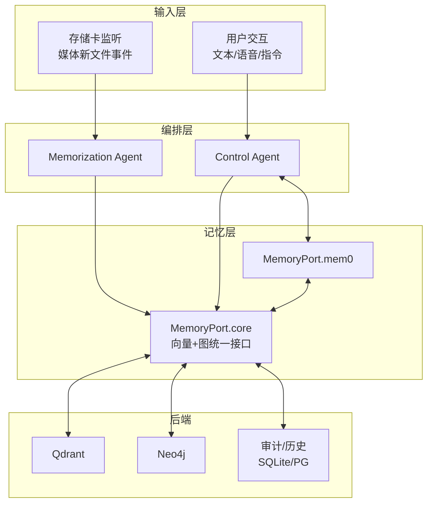
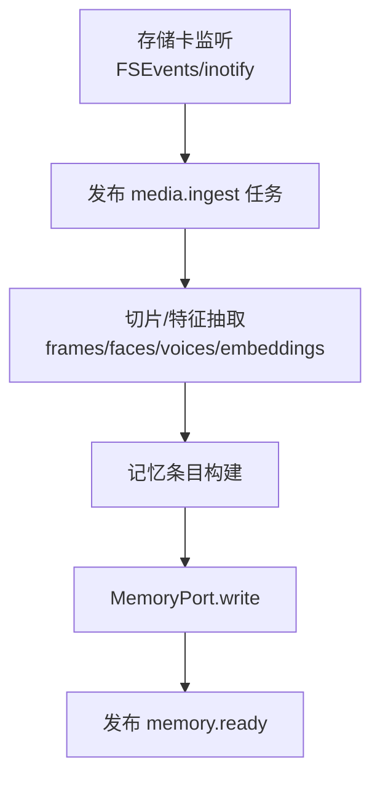
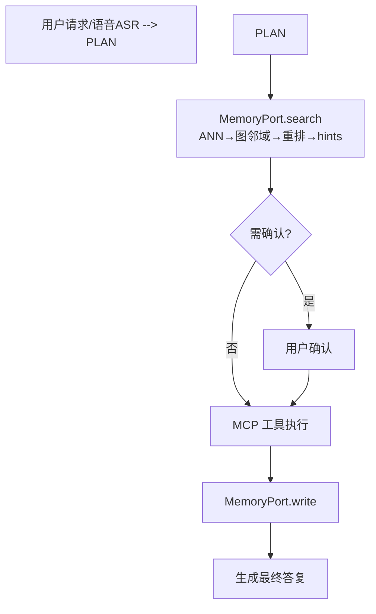
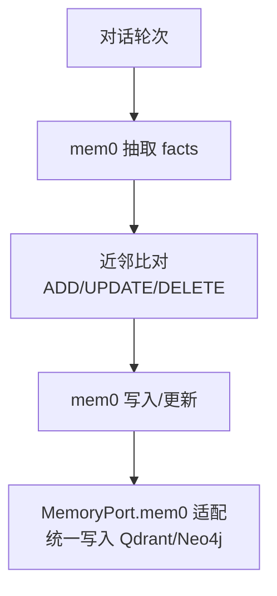
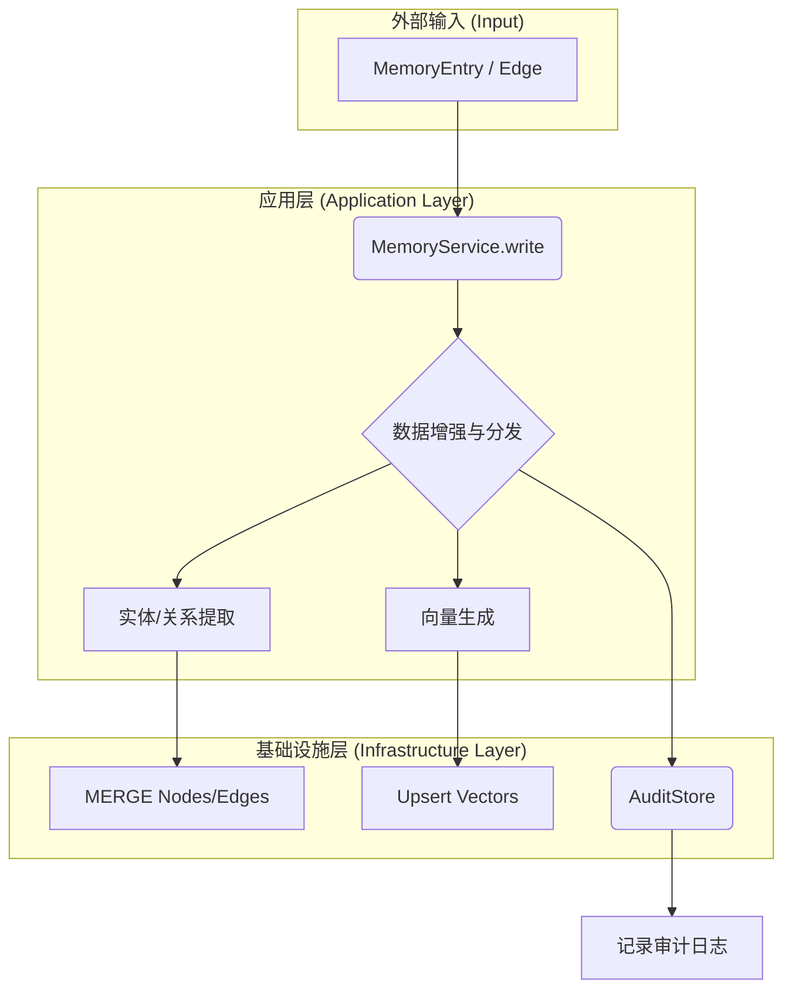

# Memory 模块（统一记忆体：Qdrant + Neo4j）

目的（Purpose）
- 提供单一统一记忆体（向量 + 图）的读写/检索/编辑能力，服务 Control、Memorization 等上层模块。
- 将不同来源（m3/mem0/ctrl）的输入在入口归一化与治理（Normalize & Enrich Pipeline），落地为统一的数据/图结构。

输入（Inputs）
- 来自 Memorization 的媒体构建结果（img/voice 向量、episodic/semantic 文本、clip_id/timestamp/实体关系）。
- 来自 Control 或 mem0 的文本 facts/更新（ADD/UPDATE/DELETE/NONE 决策）。
- 搜索请求（query + filters：modality/time_range/entities/rel_types/importance/stability/ttl/memory_type/source）。

输出（Outputs）
- 检索结果（hits/neighbors/hints/trace）。
- 写入/更新/删除的版本号与审计记录。
- 图关系 link 的变更结果。

主要入口（Entrypoints）
- `ports/memory_port.py`：MemoryPort 协议（search/write/update/delete/link）。
- `application/service.py`：用例编排（Normalize & Enrich Pipeline）。
- `api/memory_toolspec.json`：memory.* 工具（MCP）对外契约。

契约（Contracts）
- `contracts/memory_models.py`：MemoryEntry/Edge/SearchFilters/SearchResult/Version 等模型（Pydantic）。

运行手册（Runbook）
- 初始化：确保 Qdrant 与 Neo4j 已启动，执行 `scripts/setup_env.py` 完成索引/库检查。
- 写入：通过 adapters（mem0_adapter/m3_adapter）将来源映射为 MemoryEntry/Edge 再交给 service.write。
- 检索：调用 service.search（ANN→图邻域→重排→hints）。
- 编辑：update/delete/link 统一走 MemoryPort；高风险字段由 Safety 审批。
- 审计：audit_store 记录 ADD/UPDATE/DELETE 历史；支持按 version 回滚（需在 service 层实现）。

统一字段与作用域（关键）
- 三键：`metadata.user_id: list[str]`（对象强隔离，支持多值）、`metadata.memory_domain: str`（域内优先检索/治理）、`metadata.run_id: str`（会话/任务打包）。
- 检索作用域：默认 `domain`，按配置回退顺序 `session → domain → user`；支持 `user_match=any|all`。
- 图邻域限制：默认仅在相同 `user_id ∧ memory_domain` 内展开；可通过运行时开关允许跨域/跨用户（诊断/管理场景）。

运行时热更新与缓存
- 热更新接口（HTTP）：
  - `/config/search/rerank`：alpha/beta/gamma/delta + user/domain/session_boost
  - `/config/graph`：rel_whitelist/max_hops/neighbor_cap_per_seed 以及 restrict_to_user/restrict_to_domain/allow_cross_user/allow_cross_domain
- 搜索缓存：键包含 `scope`、最终过滤与“图参数签名”，确保开关切换不命中过期结果。

模块边界与数据接口（重要）
- 职责划分
  - 记忆层（本模块）：统一数据模型与接口、落库/检索、治理、审计与指标；提供 ETL（pkl→MemoryEntry/Edge）。
  - 编排层（memorization/control）：m3 多模态处理（切片/抽取/VideoGraph 生成）、control 事件处理；完成后调用 MemoryPort（或 ETL）。
- 数据传输接口
  - MemoryPort（同进程最佳）：`ports/memory_port.py` 协议；实现位于 `application/service.py`。
  - HTTP API（跨进程）：`api/server.py` 暴露 `/search /write /update /delete /link`。
  - MCP 工具（跨语言/工具生态）：`api/memory_toolspec.json`；适配可参考 `api/mcp_server.py`（示例，非全局注册）。
  - ETL 输入：VideoGraph pkl（m3 产物）；详见 `etl/README.md` 与 `etl/pkl_to_db.py`。
  - 事件发布：MemoryService 支持注入 `event_publisher(event, payload)` 可选回调（默认不绑定）。推荐在编排层注入全局事件总线并订阅 `memory_ready`。

## 接口参考（Interface Reference）

以下为对外/对上层的标准调用方式，便于编排层快速接线：

- MemoryPort（同进程，推荐）
  - 搜索：`MemoryService.search(query, topk=10, filters: SearchFilters|None, expand_graph=True, threshold=None, scope=None)`
    - 入参：`query` 文本；`filters` 参考 `contracts/memory_models.py:SearchFilters`（核心：`user_id(list)`/`user_match`、`memory_domain`、`run_id`）；`expand_graph` 是否展开邻域；`scope` 控制 `session|domain|user`，按配置自动回退
    - 出参：`SearchResult`（hits/neighbors/hints/trace）
  - 写入：`MemoryService.write(entries: list[MemoryEntry], links: list[Edge]|None, upsert=True)`
    - 入参：条目与关系（使用 `contracts/memory_models.py` 定义）
    - 出参：`Version`（批次版本号）
  - 更新/删除/连边：`update(id, patch, reason) / delete(id, soft=True, reason) / link(src_id, dst_id, rel_type, weight)`
  - 事件回调（可选）：`set_event_publisher(publish)`，其中 `publish(event, payload)` 由编排层注入

- HTTP API（跨进程）
  - `POST /search`：body `{"query": str, "topk": int, "expand_graph": bool, "threshold": float|null, "filters": {...}}`
    - filters 核心字段：`user_id(list)`/`user_match:any|all`、`memory_domain`、`run_id`
  - `POST /write`：body `{"entries": [...], "links": [...]|null, "upsert": true}`
  - `POST /update`：body `{"id": str, "patch": {...}, "reason": str|null}`
  - `POST /delete`：body `{"id": str, "soft": true, "reason": str|null}`
  - `POST /link`：body `{"src_id": str, "dst_id": str, "rel_type": str, "weight": float|null}`

- MCP 工具（跨语言/工具生态）
  - ToolSpec：`api/memory_toolspec.json`
  - 适配样例：`api/mcp_server.py`（内存适配器，演示如何将 `memory.*` 路由到 `MemoryService`）
  - 编排层集成：在上层 MCP 服务器中注册该 ToolSpec，并在 handler 中转发到 HTTP 或直调 `MemoryService`

- ETL 接口（离线/批量导入）
  - CLI：`python -m modules.memory.etl.pkl_to_db --input <path_to_videograph.pkl> [--dry-run] [--inmem] [--batch-size 1000]`
  - 说明：
    - 自动将 VideoGraph 的 nodes/edges 转为统一 `MemoryEntry/Edge`
    - 追加 `describes(semantic→episodic)`、`located_in`（room）与 `equivalence(face|voice→character)`（若提供）
    - 若 `MemoryEntry.vectors` 缺失，则基建侧可按 .env/YAML 兜底生成（见 ENVIRONMENT.md）

目录速览
- contracts：契约与 Schema。
- ports：MemoryPort 协议接口。
- domain：纯策略（importance/ttl/pinned、去重合并等）。
- application：用例编排与 Pipeline 实现骨架。
- adapters：数据来源适配与映射。
- infra：Qdrant/Neo4j/Audit 的出站实现存根。
- api：memory.* ToolSpec（MCP）与过滤器说明。
- etl：m3 VideoGraph pkl → Qdrant/Neo4j 的导入脚本存根。
- tests：单测/集成/e2e 占位，便于“填空式”实现。

# 统一记忆系统架构设计（MemoryPort.core + mem0 适配，Qdrant + Neo4j）

本设计遵循最终决议（方案 2）：

- 构建自有 MemoryPort.core（向量 + 图），按 m3-agent 的 img/voice/episodic/semantic 模型精准建模；
- Control 与 Memorization 均通过 MemoryPort 访问记忆层；
- 对 Control 开放 memory.search/write/update/delete/link 工具与 MCP 并列，形成“检索→计划→确认→执行→回写→（必要时）编辑记忆”的闭环；
- 引入 SafetyPort 与审计/版本机制，关键编辑需确认；
- 集成 MemoryPort.mem0 适配器，用于“会话/短期文本记忆”的快速接入（可配置开关/同步策略）。
- 后端：Qdrant（向量）+ Neo4j（图）。

---

## 1. 总体架构与模块边界



关键点：

- MemoryPort.core 负责“统一数据模型/接口/路由/策略”；mem0 作为“会话/短期文本记忆”的适配层，仅在需要时启用，并与 core 保持一致的 ID 与写入策略。
- 所有写入都经 MemoryPort（含 mem0 适配），确保统一审计/版本与 Safety 审批。

---

## 2. 数据模型（对齐 m3-agent + 引入 mem0 策略元数据）

实体与节点类型（Neo4j 节点 + Qdrant 向量条目）：

- img（人脸实体）：
  - 向量：图像向量（CLIP/Face）
  - 元数据：aliases[], person_id?, source, created_at
- voice（语音实体）：
  - 向量：说话人向量（ERes2NetV2）
  - 元数据：asr_snippets[], speaker_id?, source
- episodic（情节文本）：
  - 向量：文本向量（text-embedding/bge）
  - 元数据：contents[], clip_id, timestamp, importance, ttl, pinned, source
- semantic（语义文本）：
  - 向量：文本向量（text-embedding/bge）
  - 元数据：contents[], stability, importance, pinned, source
- 设备/房间/用户等实体（可选）：device/room/user/character

边与权重（Neo4j 关系）：

- appears_in(img|voice|character) -[appears_in]-> episodic
- said_by(voice|character) -[said_by]-> episodic
- located_in(episodic|device) -[located_in]-> room
- caused_by(episodic) -[caused_by]-> event/episode
- equivalence(face_x/voice_y) -[equivalence]-> character_k
- prefer(user|character) -[prefer]-> semantic
- 执行轨迹：action(actor|device) -[executed]-> episodic

策略元数据（引入 mem0 思想）：

- importance: [0..1]（重要性得分）
- stability: [0..1]（长期稳定度/持久性）
- ttl: datetime | None（短期记忆过期时间）
- pinned: bool（固定不回收）
- version: int（版本号）
- audit: trace/span/actor/role

ID 与命名：

- 全局使用 UUIDv4；clip_id/timestamp 作为检索过滤字段。

---

## 2.1 统一归一化与增强管道（Normalize & Enrich Pipeline）

重要澄清：本设计不是维护“两套图再统一”，而是“单一统一记忆体”（一套向量库 + 一套图库）。来自 m3（视频/音频）与 mem0（会话/文本）的记忆都通过 MemoryPort.core 的归一化与治理管道，落在同一套 Qdrant + Neo4j 上。

流水线步骤（适用于一切写入）：

1) 源识别与映射
   - source: "m3" | "mem0" | "ctrl" | …；根据 source 选择 Ingest Profile。

2) Schema 归一化
   - 统一生成 MemoryEntry：kind(episodic/semantic)、modality(text/img/voice)、contents[]、vectors（缺则计算）、metadata（clip_id/timestamp/room/device/user…）。

3) 实体/关系抽取与建边
   - m3 来源：复用 m3 的实体占位符与关系（appears_in/said_by/equivalence），并做角色等价映射（face/voice→character）。
   - mem0 来源：调用 mem0 的实体/关系抽取（graph_memory）或自研 NER/LLM，写 Neo4j 节点/关系；能定位到 clip_id/timestamp 时一并落地。

4) 治理元数据补齐（mem0 思想）
   - importance/stability：启发式或 LLM 打分；ttl/pinned：按规则生成（低重要性短 TTL，执行轨迹可默认长期）。
   - version/audit：统一 trace/span/actor/role。

5) 去重与合并
   - ANN 相似度阈值 + hash 指纹；命中则 update，否则 add。
   - 若存在语义冲突或需合并，调用 LLM 的 UPDATE/DELETE/NONE 逻辑（复用 mem0 的提示模板）

6) Upsert & 建图
   - Qdrant upsert（按 modality 分集合）；Neo4j 节点 upsert + 关系 merge；必要时更新边权（对应 m3 的 reinforce/weaken）。

7) 审计/版本/回滚
   - 统一写入历史；每次变更 version++。

Ingest Profiles（建议）

- profile_m3_episodic / profile_m3_semantic：保留 m3 连边与角色映射；补齐 governance 元数据（importance/ttl/pinned），按阈值强化/新建；经 dedup→upsert 落地。
- profile_mem0_fact：mem0 抽取 facts 与合并；再做实体/关系抽取，建边；补齐 governance 元数据；经 dedup→upsert 落地。

小示例（伪代码）

```python
# m3 episodic
entry = normalize_m3_episodic(raw)
entry = enrich_governance(entry)              # importance/ttl/pinned
entry, edges = extract_entities_edges(entry)  # appears_in/said_by/…
op = dedup_or_update(entry)                   # ANN+hash；必要时 LLM 合并
upsert_qdrant(entry); merge_neo4j(entry, edges); audit()

# mem0 fact
facts = mem0_extract(messages)
for f in facts:
  similar = ann_topk(f)
  action = llm_update_decision(similar, f)   # ADD/UPDATE/DELETE/NONE
  if action is ADD:
     entry = normalize_mem0_text(f)
     entry = enrich_governance(entry)
     entry, edges = extract_entities_edges(entry)
     upsert_qdrant(entry); merge_neo4j(entry, edges); audit()
  elif action is UPDATE/DELETE:
     apply_change(action); audit()
```

接口稳定性

- 对外 memory.* 工具签名不变；内部全部基于“统一记忆体”实现（Qdrant+Neo4j），无需双套存储或跨库聚合。

---

## 3. 数据流管道（端到端流程图）

### 3.1 媒体记忆构建（存储卡 → Memorization → MemoryPort）



说明：

- 复用 m3-agent 的切片/人脸/语音组件（详见第 6 节）。
- 记忆构建遵循 m3 的实体中心建图；同时写入策略元数据（importance/stability/ttl/pinned）。

### 3.2 控制检索与回写（Control → MemoryPort）



说明：

- 检索策略见 4.1；回写将动作结果/设备状态作为情节记忆写入，并按需要固化偏好为语义记忆。

### 3.3 会话/短期文本记忆（mem0 适配）



说明：

- 采用 mem0 的 fact 抽取与合并规则；通过适配器避免“双份存储”，直接落到统一后端（Qdrant/Neo4j）。

---

## 4. 检索/写入/编辑（统一接口与策略）

### 4.1 检索编排（search）

- ANN 粗召回（Qdrant HNSW）：
  - 多向量支持：text/img/voice；可按 modality/clip_id/timestamp/entity 过滤。
  - TopK 召回 + 得分阈值。
- 图邻域扩展（Neo4j）：
  - 基于召回节点的邻域/路径扩展（限制 hop/关系类型/阈值）。
  - 角色映射：face_x/voice_y ↔ character_k；equivalence 优先。
- 重排与聚合：
  - 语义得分 + 关键词/BM25 + 规则加权（时间近、同一房间、同一设备）。
  - 产出 memory.hints（含引用与解释），供 LLM 上下文使用。

可选 filters（ToolSpec 建议）：

- modality: [text|img|voice]
- time_range: {gte,lte} | clip_id
- entities: [user|room|device|character|…]
- rel_types: [appears_in|said_by|located_in|equivalence|prefer|executed]
- importance_range: {gte,lte}
- stability_range: {gte,lte}
- ttl_range: {gte,lte}
- memory_type: [episodic|semantic]
- source: [m3|mem0|ctrl]

### 4.2 写入与编辑（write/update/delete/link）

- write：批量写 entries（含多模向量+元数据），自动建图连边；重要性/ttl/pinned 生效。
- update：编辑内容或元数据（带审计/版本）；高风险需 Safety 审批。
- delete：软删/硬删（默认软删，带历史）；
- link：建/改/删边，权重更新（reinforce/weaken 类似语义）。

实现说明（统一记忆体适配）：

- write：入口接收多源 entry，先走“归一化→治理补齐→去重/合并→upsert”；对 m3 补 mem0 治理元数据；对 mem0 补 m3 实体/关系。
- update/delete：同一 ID 在 Qdrant/Neo4j 共同更新/删除；默认软删，开启历史记录；高风险字段（equivalence/semantic 偏好/批量删除）需 Safety 审批。
- link：写 Neo4j 关系（MERGE/DELETE）；必要时同步边权（reinforce/weaken 对等）。

### 4.3 MCP 工具（ToolSpec 摘要）

- memory.search
  - 入参：query, filters{modality, clip_id, time_range, entities, threshold}, topk, expand_graph
  - 出参：hits[{id, memory, score, metadata}], neighbors, hints, trace
- memory.write
  - 入参：entries[{kind, modality, contents, vectors?, metadata{clip_id,timestamp,importance,ttl,pinned,...}}], links[]
  - 出参：ids, version
- memory.update
  - 入参：id, patch{memory/metadata}, reason
  - 出参：version
- memory.delete
  - 入参：id, soft=true, reason
  - 出参：version
- memory.link
  - 入参：src_id, dst_id, rel_type, weight?
  - 出参：ok

---

## 5. 审计/版本/安全（SafetyPort）

- 审计：
  - SQLite/PG 记历史（id, old, new, event, actor, role, created_at/updated_at, is_deleted）。
- 版本：
  - 每次变更 version++；支持按版本回滚。
- 安全：
  - 编辑策略：高影响字段（semantic 偏好、equivalence、delete 知识）需确认或白名单；
  - 执行轨迹写入默认允许；大范围删除需要二次确认。

---

## 6. 可直接复用的代码与改造点

### 6.1 复用（m3-agent）

- 切片/特征：
  - 视频/帧/音频抽取：`m3-agent/mmagent/utils/video_processing.py:1`
  - 语音分段/嵌入：`m3-agent/mmagent/voice_processing.py:1`
  - 人脸处理：`m3-agent/m3_agent/memorization_intermediate_outputs.py:48`
- 记忆构建：
  - 实体占位符解析：`m3-agent/mmagent/memory_processing.py:1-44(parse_video_caption)`
  - 记忆抽取（episodic/semantic）与相似度阈值强化/新建：`m3-agent/mmagent/memory_processing.py:202-280`
- 检索思想：
  - 多轮检索/重排：`m3-agent/mmagent/retrieve.py`

改造方式：

- 不再写入内存 VideoGraph/pkl；改为通过 MemoryPort 写 Qdrant/Neo4j；保留 parse/阈值/强化逻辑在“图边权重更新/实体等价映射”上。

### 6.2 复用（mem0）

- 事实抽取与合并：
  - 抽取 facts：`mem0/mem0/configs/prompts.py:FACT_RETRIEVAL_PROMPT` + `memory/main.py:347-366`
  - 合并/去重（ADD/UPDATE/DELETE/NONE）：`mem0/mem0/configs/prompts.py:291-420` + `memory/main.py:399-467`
- 图实体/关系抽取与删除：
  - `mem0/mem0/memory/graph_memory.py` + `mem0/mem0/graphs/utils.py`
- 工厂/后端抽象：
  - 向量/图/LLM/嵌入工厂：`mem0/mem0/utils/factory.py`
- 审计：
  - 历史存储：`mem0/mem0/memory/storage.py`

改造方式：

- mem0 的 add()/search()/update()/delete() 不直接落自身 vector_store，而是通过 MemoryPort.mem0 适配器写入/检索统一后端（Qdrant/Neo4j），避免双写与不一致。
- 在抽取/合并阶段，生成并写入策略元数据（importance/ttl/pinned/stability）。

---

## 7. ETL（m3 pkl → Qdrant/Neo4j）

- 输入：VideoGraph pkl
- 转换：
  - 遍历 nodes：img/voice → 实体节点（附 embeddings/contents）；episodic/semantic → 文本节点（附 clip_id/timestamp/embeddings/contents）
  - 遍历 edges：写 Neo4j 关系；equivalence → character 映射
- 写入：
  - Qdrant collections：`memory_text`, `memory_img`, `memory_voice`
  - Neo4j labels：`Image|Voice|Episodic|Semantic|Device|Room|User|Character`
- 校验：
  - 随机抽样节点/边数量、向量维度；
  - 检索对齐：同一 query 在旧 VideoGraph 与新检索 pipeline 的 TopK 近似一致。

---

## 8. 与 mem0 并行/融合策略

- 统一后端：mem0 适配器直连 MemoryPort，写入同一 Qdrant/Neo4j，避免“双套存储”。
- 分类：
  - 会话/短期文本：通过 mem0 抽取合并；
  - 多模与实体图：由 Memorization/MemoryPort.core 直接写入；
  - 统一以 filters/metadata 控制检索范围与优先级。
- 风险：
  - 双通道合并冲突：以 version 与更新时间序保障，策略冲突需 Safety 审批；
  - 重复写入：hash + 相似度阈值 + LLM 合并共同约束。

---

## 9. 开放接口（MemoryPort）

接口定义（伪代码）：

```python
class MemoryPort(Protocol):
    async def search(self, query: str, filters: dict, topk: int, expand_graph: bool) -> SearchResult: ...
    async def write(self, entries: list[MemoryEntry], links: list[Edge]|None=None) -> WriteResult: ...
    async def update(self, id: str, patch: dict, reason: str) -> Version: ...
    async def delete(self, id: str, soft: bool=True, reason: str|None=None) -> Version: ...
    async def link(self, src_id: str, dst_id: str, rel_type: str, weight: float|None=None) -> bool: ...
```

JSON Schema（摘要）：

- MemoryEntry：{ id?, kind, modality, contents[], vectors?, metadata{clip_id,timestamp,importance,ttl,pinned,stability,source} }
- Edge：{ src_id, dst_id, rel_type, weight? }
- SearchResult：{ hits[], neighbors[], hints, trace }

---

## 10. 性能与参数建议

- Qdrant（HNSW）：M=32, ef_construction=128, ef_search=64；多向量字段按 modality 分集。
- Neo4j：节点 embedding 属性开向量索引（cosine）；关系扩展限制 1–2 hop，过滤关系类型。
- 缓存：热点查询与 hints 缓存 30–120 秒；
- 背压：Memorization/Control 独立队列与速率限制。

---

## 11. 开发计划（里程碑）

- W1：Schema/接口确定；MemoryPort.core（PG 伪实现）+ ToolSpec 草案；ETL 骨架
- W2：接 Qdrant/Neo4j；Memorization 写入打通；Search 编排 MVP
- W3：Control 接入 memory.*；Safety 审批与审计；回归 m3 检索一致性
- W4：mem0 适配（会话层）+ 重要性/TTL/Pin 策略；监控/报警；e2e 演示

---

## 12. 附：可直接复用与需改造清单

可直接复用：

- m3-agent：
  - `mmagent/utils/video_processing.py`（切片/提取）
  - `mmagent/voice_processing.py`（分段/嵌入/匹配）
  - `mmagent/memory_processing.py`（占位符解析/相似度策略/构建逻辑）
- mem0：
  - `memory/main.py`（add/search/update/delete 编排思路）
  - `configs/prompts.py`（事实抽取/合并提示模板）
  - `memory/graph_memory.py`（实体/关系提取与 Neo4j 写入）
  - `utils/factory.py`（LLM/Embedder/Vector/Graph 工厂）
  - `memory/storage.py`（历史审计）

需改造：

- 将 m3 的输出改为 MemoryPort.write（而非写入 VideoGraph/pkl）。
- 将 mem0 的向量与图操作改走 MemoryPort（避免双存），并写入策略元数据（importance/ttl/pinned）。
- 检索改为“Qdrant ANN → Neo4j 邻域 → 重排”，替换 m3 的 numpy/similarity。
- 统一 ID/filters/metadata 字段；接入 Safety 审批与版本化。

---

本设计将 m3-agent 的“多模实体图 + 记忆构建”与 mem0 的“记忆抽取/合并/治理”融合到统一 MemoryPort 上，后端采用 Qdrant + Neo4j，既保证检索性能与可解释的关系扩展，又具备短/长期治理、TTL/Pin、审计与安全策略，可在家庭场景下稳定扩展。

---

## 13. 融合策略规范（m3 + mem0）

节点类型统一（MemoryEntry.kind/modality + 图标签）：
- Image（face）：kind=semantic, modality=image，来源 m3（faces）
- Voice（speaker）：kind=semantic, modality=audio，来源 m3（voices）
- Episodic：kind=episodic, modality=text（情节，含 clip_id/timestamp）
- Semantic：kind=semantic, modality=text（事实/偏好/总结）
- 结构实体：modality=structured（如 user/device/room/character）

关系与权重：
- appears_in(img|voice|character) -> episodic（w∈[0,1]，重复出现 reinforce 累加）
- said_by(voice|character) -> episodic（reinforce 累加）
- located_in(episodic|device) -> room
- executed(device|actor) -> episodic（设备执行轨迹）
- prefer(user|character) -> semantic（偏好关系）
- equivalence(face|voice) -> character（角色映射）

治理元数据：
- source[m3|mem0|ctrl]、importance/stability/ttl/pinned、version/audit、hash/created_at/updated_at、evidence_ids。

去重/合并：
- 文本：ANN 近邻 + 指纹；冲突交给 LLM 决策（ADD/UPDATE/DELETE/NONE）。
- 图像/语音：embedding 阈值；命中则 equivalence→character；否则新建。

适配器实现要点：
- m3_adapter：
  - 生成 image/audio/episodic/semantic 四类条目；分配稳定 ID；
  - 建立 appears_in/said_by/located_in/executed 等边，权重默认 1.0；重复写入累加。
- mem0_adapter：
  - 生成 semantic 文本条目；可选生成 user 实体；检测“喜欢/偏好”模式建立 prefer 边；
  - 上层可配置 LLM 决策（DEFAULT_UPDATE_MEMORY_PROMPT）驱动 ADD/UPDATE/DELETE/NONE；本模块提供 `update_decider` 钩子。

图权重与衰减：
- 默认重复出现增权（reinforce）；可按时间窗口周期性衰减（后续任务）。

---

## 14. 核心数据流图

### 写入管道 (Write Pipeline)



### 搜索管道 (Search Pipeline)

```mermaid
graph TD
    subgraph "外部输入 (Input)"
        A[查询文本 + 过滤条件]
    end

    subgraph "应用层 (Application Layer)"
        B(MemoryService.search)
        C{混合搜索与重排}
        D[α: 向量检索]
        E[β: 关键词检索]
        F[γ: 图关系扩展]
        G[δ: 时间衰减]
        H[综合重排]
    end

    subgraph "基础设施层 (Infrastructure Layer)"
        I(QdrantStore)
        J(Neo4jStore)
    end
    
    subgraph "输出 (Output)"
        K[Top-K 记忆结果]
    end

    A --> B
    B --> C
    C --> D --> I[search_vectors]
    C --> E
    C --> F --> J[expand_neighbors]
    C --> G
    I --> H
    J --> H
    H --> K
