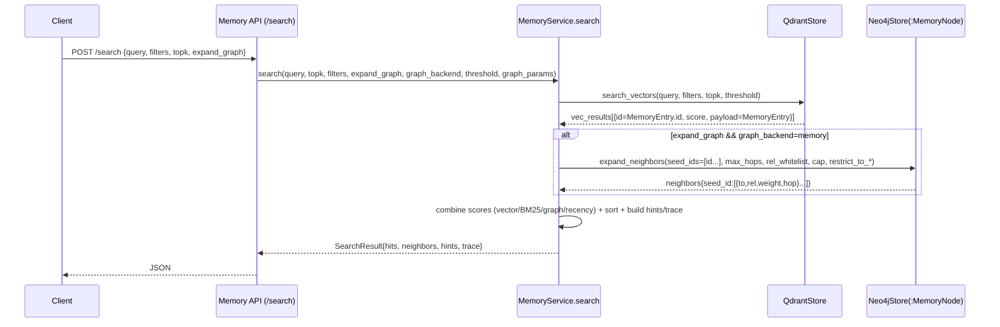

# Memory 检索体系：Qdrant + Neo4j（API 全量清单 + 节点/映射/工作流）

> 目标：把当前工程里“Qdrant 里到底存什么、Neo4j 里到底存什么、两者如何通过唯一 ID 对齐、检索 API 有哪些、它们怎么工作”一次讲清楚。  
> 结论先放这：**/search 的默认链路是 `Qdrant ANN(种子)` → `Neo4j(:MemoryNode) 邻域扩展` → `混合重排`**；而 **/graph/v1/search 是 Graph-first：直接在 typed TKG Graph(:Event/:Evidence/...) 里召回并返回证据链**。

---

## 0. 名词对齐（避免“Q状/near4G”口误）

- **Qdrant**：向量库，负责 ANN（Approximate Nearest Neighbor）粗召回。
- **Neo4j**：图库，当前同库内维护“两张图”：
  - **Typed TKG Graph（真相图）**：`MediaSegment/Evidence/UtteranceEvidence/Entity/Event/...`，带 `(tenant_id,id)` 约束与 fulltext 索引；用于可解释证据链与结构化查询。
  - **MemoryEntry Projection Graph（投影图）**：`:MemoryNode`（以及 `:Episodic/:Semantic/:Image/:Voice/:Structured` 辅助标签），为 `/search` 的邻域扩展服务，可丢可重建。

代码锚点：
- MemoryEntry 合同：`modules/memory/contracts/memory_models.py`
- TKG 合同：`modules/memory/contracts/graph_models.py`
- Qdrant 适配：`modules/memory/infra/qdrant_store.py`
- Neo4j 适配：`modules/memory/infra/neo4j_store.py`
- /search 编排：`modules/memory/application/service.py`
- HTTP 服务：`modules/memory/api/server.py`

---

## 1. Qdrant 里存什么（“向量节点/点”的真实结构）

### 1.1 Collection（集合）划分

实现：`modules/memory/infra/qdrant_store.py::QdrantStore.__init__`

- 默认集合映射（可配置覆盖）：
  - `text` → `memory_text`
  - `image` → `memory_image`
  - `audio` → `memory_audio`
- 可选集合（只有在 `settings.collections` 显式配置时才会创建/使用）：
  - `clip_image`：用于跨模态 text→image 的 OpenCLIP 对齐向量
  - `face`：用于身份空间（人脸向量）

集合创建/确保存在：
- `QdrantStore.ensure_collections()`：按 embedding 配置维度创建集合（REST `PUT /collections/{coll}`）。

### 1.2 Point（点）结构：id / vector / payload

写入实现：`modules/memory/infra/qdrant_store.py::QdrantStore.upsert_vectors`

每个点最核心的三件事：
- **Point ID**：`pid = entry.id`（若缺失，MemoryService 会先生成 UUID；极端情况下 QdrantStore 会 fallback 用 md5(payload)）
- **vector**：由 embedder 生成（text/image/audio/...），或直接使用 `entry.vectors[modality]`
- **payload**：完整 `MemoryEntry`（pydantic `model_dump()` 的字典），并额外补一个调试字段 `content=contents[0]`

payload 对应 `MemoryEntry` 结构（摘要）：
- `id`: str（核心唯一 ID）
- `kind`: `"episodic" | "semantic"`
- `modality`: `"text" | "image" | "audio" | "structured"`
- `contents`: `List[str]`（永远是 list；第一条通常是“主文本”）
- `vectors`: `Dict[str, List[float]]`（可选；如 `{"text":[...], "face":[...]}`）
- `metadata`: `Dict[str, Any]`（治理与隔离的关键字段，见 1.3）

### 1.3 Qdrant 过滤：哪些 filters 会变成哪些 payload key？

实现：`modules/memory/infra/qdrant_store.py::QdrantStore._build_filter`

Qdrant 端实际用的是 `must/should/must_not` 三段 filter（不使用 minimum_should_match）。

当前会被识别并映射的典型字段（“左边是 SearchFilters/filters 字段，右边是 Qdrant payload key”）：
- `filters.modality[]` → `payload.modality`
- `filters.memory_type[]` → `payload.kind`
- `filters.source[]` → `payload.metadata.source`
- `filters.tenant_id` → `payload.metadata.tenant_id`
- `filters.user_id[]`（any/all）→ `payload.metadata.user_id`（多值匹配，any 用 should，all 用 must）
- `filters.memory_domain` → `payload.metadata.memory_domain`
- `filters.run_id` → `payload.metadata.run_id`
- `filters.memory_scope` → `payload.metadata.memory_scope`
- `filters.character_id[]` → `payload.metadata.character_id`
- `filters.clip_id` → `payload.metadata.clip_id`
- `filters.time_range.gte/lte`（数字）→ `payload.metadata.timestamp` 的 range

隐式行为（非常重要）：
- **默认会排除内部索引来源**：`tkg_dialog_utterance_index_v1`（通过 must_not `metadata.source` 实现）  
  只有当调用方显式把 `filters.source` 设为该来源时才会放开。

---

## 2. Neo4j 里存什么（两张图：typed TKG vs :MemoryNode 投影）

### 2.1 Typed TKG Graph：节点类型、约束与索引

合同模型：`modules/memory/contracts/graph_models.py::GraphUpsertRequest`

节点（labels）：
- `:MediaSegment`
- `:Evidence`
- `:UtteranceEvidence`
- `:Entity`
- `:Event`
- `:Place`
- `:TimeSlice`
- `:SpatioTemporalRegion`
- `:State`
- `:Knowledge`
- `:PendingEquiv`

边（relationships）：
- `GraphEdge.rel_type` 是字符串；Graph 侧按 rel_type 分组写入（并在查询里使用固定关系，如 `SUMMARIZES/INVOLVES/OCCURS_AT/NEXT_EVENT/CAUSES/...`）。

Schema 初始化（约束与索引）：
- 实现：`modules/memory/infra/neo4j_store.py::Neo4jStore._ensure_v0_schema`
- 约束（全部是 `(tenant_id, id)` 唯一）：
  - `:MediaSegment/:Evidence/:Entity/:Event/:Place/:TimeSlice/:UtteranceEvidence/:SpatioTemporalRegion/:State/:Knowledge/:PendingEquiv`
- Fulltext 索引（Graph-first 搜索用）：
  - `tkg_event_summary_v1` on `:Event(summary)`
  - `tkg_utterance_text_v1` on `:UtteranceEvidence(raw_text)`
  - `tkg_evidence_text_v1` on `:Evidence(text)`

### 2.2 MemoryEntry Projection Graph：:MemoryNode（/search 邻域扩展用）

写入实现：
- `modules/memory/application/service.py::MemoryService.write` → `Neo4jStore.merge_nodes_edges*`
- `modules/memory/infra/neo4j_store.py::Neo4jStore.merge_nodes_edges`

节点 label：
- 基类：`:MemoryNode`
- 辅助标签（按 `kind/modality` 回填）：
  - `:Episodic`
  - `:Semantic`
  - `:Image`
  - `:Voice`
  - `:Structured`

节点属性（当前写入的字段非常“硬核”，就是这些）：
- `id`（唯一约束：`(:MemoryNode).id UNIQUE`）
- `kind` / `modality`
- `text`（一般是 `contents[0]`）
- `source`（来自 `metadata.source`）
- `timestamp`（来自 `metadata.timestamp`）
- `clip_id`（来自 `metadata.clip_id`）
- `memory_domain`（来自 `metadata.memory_domain`）
- `run_id`（来自 `metadata.run_id`）
- `user_id`（来自 `metadata.user_id`，数组）
- `memory_scope`（来自 `metadata.memory_scope`）

投影图边（relationships）：
- 写入入口：`Neo4jStore.merge_nodes_edges` / `Neo4jStore.merge_rel` / `MemoryService.link`
- 关系类型白名单（服务层进一步限制）：`modules/memory/application/service.py::_allowed_rel_types`
  - `appears_in`, `said_by`, `located_in`, `equivalence`, `prefer`, `executed`, `describes`, `temporal_next`, `co_occurs`
- 邻域扩展读取：`modules/memory/infra/neo4j_store.py::Neo4jStore.expand_neighbors`
  - 支持 `max_hops`（当前实现明确支持 hop=1/2；>2 会走额外分支但依然受 cap 限制）
  - 支持按 `user_id/memory_domain/memory_scope` 收紧扩展范围（避免跨用户/跨域污染）

---

## 3. Qdrant 与 Neo4j 的“唯一 ID / UID 对应关系”

这里别搞玄学：当前工程里“向量点 ↔ 图节点”的**硬映射**只有一条：

### 3.1 MemoryEntry.id 是主键（跨库对齐）

- **Qdrant point id** = `MemoryEntry.id`
- **Neo4j :MemoryNode.id** = `MemoryEntry.id`

写入时由 `MemoryService.write` 统一确保：
- `entry.id` 为空或为占位符（`tmp-* / dev-* / loc-* / char-*`）→ 直接替换为 UUID（并可返回 `id_map`）
- 然后：
  1) `QdrantStore.upsert_vectors(entries)` 用 `entry.id` 当 point id
  2) `Neo4jStore.merge_nodes_edges*(entries)` 用 `entry.id` 当 :MemoryNode.id

### 3.2 typed TKG Graph 的 ID 体系是另一套（带 tenant_id）

Typed TKG Graph 的每个节点也有 `id`，但它不是 MemoryEntry.id 的必然同名空间：
- TKG 节点主键是 `(tenant_id, id)`，并且节点类型（label）不同。
- TKG Graph 与 MemoryEntry 的“桥接”是**通过 metadata** 发生的（见 4.2 的 tkg backend）。

目前代码里出现的桥接线索：
- `MemoryService._tkg_event_id_from_entry_meta(meta)`：从 `MemoryEntry.metadata` 尝试提取/推导 `tkg_event_id`
  - 优先使用 `metadata.tkg_event_id`
  - 否则会用 `tenant_id + sample_id + turn_index` 之类字段做 best-effort 推导（对话流水线产物）

---

## 4. 检索工作流：从“向量模糊匹配”到“图扩散/邻域扩展”

这里按真实实现描述，不做“应该怎样”的臆想。

### 4.1 默认检索：`POST /search`（Qdrant ANN → Neo4j(:MemoryNode) 邻域扩展 → 重排）

入口：
- HTTP：`modules/memory/api/server.py::POST /search`
- Service：`modules/memory/application/service.py::MemoryService.search`

核心阶段：

1) **Scope/Filters 归一化与回退链路**
   - `SearchFilters` 里包含 `tenant_id/user_id/memory_domain/run_id/memory_scope/...`
   - Service 会按配置做 scope 尝试与 fallback（典型是 session→domain→user），直到 Qdrant 返回非空候选。

2) **Qdrant ANN 粗召回（种子）**
   - `QdrantStore.search_vectors(query, filters, topk, threshold)`
   - 返回 `vec_results[]`，每项形如：
     - `id`:（point id，也就是 MemoryEntry.id）
     - `score`: 向量相似度（Qdrant 返回）
     - `payload`: `MemoryEntry`（从 Qdrant payload 反序列化）
   - 如果配置阈值 `threshold` 把结果全过滤掉，且开启 `relax_threshold_on_empty`，会自动 retry 一次（不带 score_threshold）。

3) **（可选）Neo4j 邻域扩展（“图扩散”在当前工程的定义）**
   - 触发条件：`expand_graph=true` 且配置允许 `gcfg.expand`
   - 默认图后端：`graph_backend="memory"` → 扩展的是 **:MemoryNode 投影图**
   - 种子集合：`seed_ids = [hit.id for hit in vec_results]`
   - 调用：`Neo4jStore.expand_neighbors(seed_ids, rel_whitelist, max_hops, cap, ...)`
   - 输出结构（服务端统一形状）：
     - `{"neighbors": {seed_id: [{"to": id, "rel": str, "weight": float, "hop": int}, ...]}, "edges": []}`
   - 限制策略：
     - `rel_whitelist`：默认来自 `memory.search.graph.rel_whitelist`，但 `filters.rel_types` 优先级更高
     - `neighbor_cap_per_seed`：每个 seed 最多保留多少邻居
     - `restrict_to_user/domain/scope`：默认收紧；可通过 runtime overrides / 请求 `graph_params` 放开

4) **混合重排（vector + BM25 + graph + recency）**
   - 组合分数（概念）：
     - `score = alpha*vscore + beta*bm25 + gamma*gscore + delta*recency`
   - graph 分数 `gscore` 来自 neighbors：对每个 seed，把邻边权重按 hop 做衰减并叠加（并乘 rel_base_weights）。

5) **输出**
   - `hits[]`：最终 topk
   - `neighbors`：邻域扩展摘要（用于解释/下游）
   - `hints`：给 LLM 的紧凑文本（只拼 top hits 的内容 + 关系摘要）
   - `trace`：包含 scope_used、attempts、graph_backend_used、weights、latency 等调试信息

> 你刚才描述的“先模糊匹配向量节点 → UID 映射到 Neo4j 做图扩散”，在当前实现里就是这条链路：  
> **Qdrant 返回 point.id（=MemoryEntry.id）→ 直接作为 Neo4j :MemoryNode.id 种子 → expand_neighbors() 展开。**

### 4.2 可选：`graph_backend="tkg"`（用 typed TKG explain 生成 neighbors 的“best-effort 扩展”）

实现：`modules/memory/application/service.py` 中 `gb_used == "tkg"` 分支

关键现实：
- 这不是把 Qdrant 命中点“映射到 typed graph 的节点”，而是：
  1) 从 `MemoryEntry.metadata` 推导 `tkg_event_id`
  2) 调用 typed graph 的 `explain_event_evidence`
  3) 把 explain payload **转换成 neighbors 结构**（用于统一的 rerank/解释输出）

硬要求：
- 必须有 `filters.tenant_id`（否则直接降级回 `memory` backend）

为什么叫 best-effort：
- 只有“来自对话索引（`tkg_dialog_utterance_index_v1`）”或写入时带了 `tkg_event_id` 的 entry，才可能推导出 event id。

---

## 5. API 全量清单（HTTP）

代码锚点：`modules/memory/api/server.py`

### 5.1 认证/租户/签名（所有 API 的统一前提）

- **租户**：
  - 当 `auth.enabled=false`：必须提供 `X-Tenant-ID`（否则 400）。
  - 当 `auth.enabled=true`：tenant 从 token/jwt/token_map 推导；但仍强烈建议带上 `X-Tenant-ID`（尤其是 client 侧与日志排查）。
- **鉴权**（可配置开启）：默认 header `X-API-Token`（可在配置里改名）。
- **签名**（部分路由 require_signature=true）：
  - `X-Signature-Ts`: int（unix seconds）
  - `X-Signature`: hex(hmac_sha256(secret, f"{ts}.{path}.{body_bytes}"))
  - 有最大时钟偏差校验（默认 300s）

### 5.2 健康与指标

- `GET /health` → `{"vectors": {...}, "graph": {...}}`
- `GET /metrics` → 内部 metrics dict
- `GET /metrics_prom` → Prometheus text

### 5.3 检索主接口

- `POST /search`
  - body：`{query, topk=10, expand_graph=true, graph_backend="memory"|"tkg", threshold?, graph_params?, filters?}`
  - filters 结构：对齐 `SearchFilters`（见 `modules/memory/contracts/memory_models.py`）
  - resp：`SearchResult`（`{hits[], neighbors, hints, trace}`）

- `POST /timeline_summary`（高成本；有 gate/timeout）
  - 用途：按时间聚合摘要（可附带图邻居）

- `POST /speech_search`
  - 用途：关键词/说话人检索（服务层二次封装）

- `POST /entity_event_anchor`
  - 用途：把实体/动作锚到事件与时间线（服务层二次封装）

- `POST /object_search`
  - 用途：按物体/场景检索（服务层二次封装）

### 5.4 写入与编辑（这些都要求签名）

- `POST /write`
  - body：`{entries: [MemoryEntry dict], links?: [Edge dict], upsert=true, return_id_map=false}`
  - resp：`Version`；当 `return_id_map=true` 时附加 `id_map`

- `POST /update`
  - body：`{id, patch, reason?, confirm?}` → `Version`

- `POST /delete`
  - body：`{id, soft=true, reason?, confirm?}` → `Version`

- `POST /link`
  - body：`{src_id, dst_id, rel_type, weight?, confirm?}` → `{ok: bool}`

- `POST /rollback`
  - body：`{version}` → `{ok: bool}`

- `POST /batch_delete`
- `POST /batch_link`

### 5.5 等价关系 pending 工作流（投影图侧；要求签名的写操作）

- `GET /equiv/pending`
- `POST /equiv/pending/add`
- `POST /equiv/pending/confirm`
- `POST /equiv/pending/remove`

### 5.6 运行时热配置（要求签名的写操作）

- `GET/POST /config/search/rerank`
- `GET/POST /config/graph`
- `GET/POST /config/search/scoping`
- `GET/POST /config/search/ann`
- `GET/POST /config/search/modality_weights`

### 5.7 Graph-first（typed TKG graph）接口族

- `POST /graph/v1/search`（高成本；有 gate/timeout）
  - body：`{query, topk=10, source_id?, include_evidence=true}`
  - resp：`{items:[{event_id, score, event, entities, places, timeslices, evidences, utterances}...]}`（结构见 `GraphService.search_events_v1` 输出）

### 5.8 Graph v0（typed graph）写入/查询/管理

- 写入
  - `POST /graph/v0/upsert`（要求签名；服务端强制注入 tenant_id）
- 等价审核（identity registry 的 pending）
  - `POST /graph/v0/admin/equiv/pending`
  - `GET /graph/v0/admin/equiv/pending`
  - `POST /graph/v0/admin/equiv/approve`
  - `POST /graph/v0/admin/equiv/reject`
- TTL 清理
  - `POST /graph/v0/admin/ttl/cleanup`
- 导出
  - `GET /graph/v0/admin/export_srot`
- 查询
  - `GET /graph/v0/segments`
  - `GET /graph/v0/entities/{entity_id}/timeline`
  - `GET /graph/v0/events`
  - `GET /graph/v0/events/{event_id}`
  - `GET /graph/v0/places`
  - `GET /graph/v0/places/{place_id}`
  - `GET /graph/v0/explain/event/{event_id}`
  - `GET /graph/v0/explain/first_meeting`
  - `GET /graph/v0/timeslices`
- 管理构建
  - `POST /graph/v0/admin/build_event_relations`
  - `POST /graph/v0/admin/build_timeslices`
  - `POST /graph/v0/admin/build_cooccurs`（`mode=timeslice|event`）

### 5.9 管理/运维

- `POST /admin/ensure_collections`（Qdrant ensure_collections）
- `POST /admin/run_ttl`（MemoryService.run_ttl_cleanup_now）
- `POST /admin/decay_edges`（图边权衰减）

---

## 6. API 全量清单（Python：模块公共入口与常用门面）

### 6.1 `modules.memory` 公共出口（允许其他模块 import 的“稳定面”）

实现：`modules/memory/__init__.py`

主要导出：
- 合同类型：`MemoryEntry`, `Edge`, `SearchFilters`, `SearchResult`, `Version`
- TKG 合同：`GraphUpsertRequest` 及各 Graph* 模型
- 服务：`MemoryService`
- 管道：`session_write`, `retrieval`
- HTTP 客户端：`HttpMemoryPort`
-（lazy）`GraphService`, `create_service`

### 6.2 MemoryPort 协议（最小可替换接口）

定义：`modules/memory/ports/memory_port.py::MemoryPort`
- `search(query, topk, filters, expand_graph, threshold, scope) -> SearchResult`
- `write(entries, links, upsert, return_id_map) -> Version | (Version, id_map)`
- `update(memory_id, patch, reason) -> Version`
- `delete(memory_id, soft, reason) -> Version`
- `link(src_id, dst_id, rel_type, weight) -> bool`
- typed graph 相关：`graph_upsert_v0 / graph_list_events / graph_list_places / graph_event_detail / graph_place_detail / graph_explain_event_evidence`

### 6.3 HttpMemoryPort（最小 HTTP 适配器）

实现：`modules/memory/adapters/http_memory_port.py::HttpMemoryPort`

覆盖的方法就是把 MemoryPort 映射到 HTTP：
- `search` → `POST /search`
- `write` → `POST /write`
- `delete` → `POST /delete`
- 以及 graph v0 查询与 upsert

### 6.4 高层检索编排：`retrieval()`（对话场景的“固定策略”编排）

实现：`modules/memory/retrieval.py::retrieval`

关键点：
- 默认策略：`strategy="dialog_v2"`（Event-first 多路并行召回 + RRF 融合 + 可选 explain）
- `strategy="dialog_v1"`：固定三段式（fact_search + event_search + 融合），主要用于 benchmark 对齐与回归基线
- `backend="tkg"|"memory"`：
  - `tkg`：用 Qdrant 先召回“utterance index（source=tkg_dialog_utterance_index_v1）”，拿到 `tkg_event_id`，再走 TKG explain（可选）
  - `memory`：走传统 `/search`（episodic）并允许图扩展
- **Never break userspace**：tkg 没命中会自动回退到 memory episodic 搜索

### 6.5 SDK 门面：`Memory`（mem0 风格）

实现：`modules/memory/client.py::Memory`

常用方法：
- `add(...)`：文本/消息写入（可选 LLM 抽取）
- `add_entries(...)`：结构化批写（M3/ETL 入口）
- `search(...)`：封装 SearchFilters + scope/fallback
- `get/update/history/delete/delete_all(...)`

---

## 7. 一张“端到端时序图”（你要的完整流程降维）

---

## 8. 你接下来最该关心的三个“地雷”（不是建议，是事实）

1) **Qdrant ↔ Neo4j 投影图靠的是 MemoryEntry.id 的强一致**  
   你如果允许写入路径出现“Qdrant 用 md5 当 id，而 Neo4j 因为 entry.id 为空直接跳过写节点”，那检索扩展就会出现“向量命中但图找不到种子”的断链。

2) **typed TKG 图不是默认 /search 的扩展图**  
   默认图扩展走的是 `:MemoryNode` 投影图。你想要“证据链级别”的答案，应该直接用 `/graph/v1/search` 或让 `graph_backend=tkg` 且保证 metadata 能推导 event_id。

3) **跨用户/跨域/跨 scope 扩展是灾难**  
   代码里已经把 restrict_to_user/domain/scope 作为默认姿态；你如果为了“召回更多”把 allow_cross_* 打开，实际效果通常是把噪声和幻觉放大。
