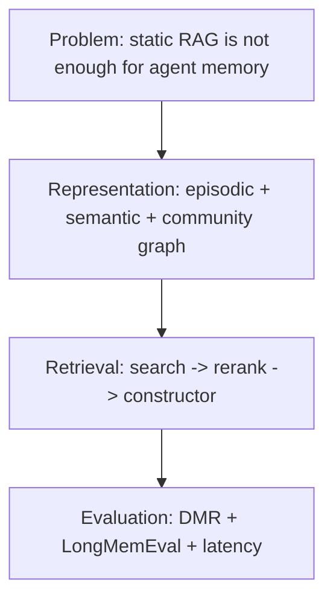
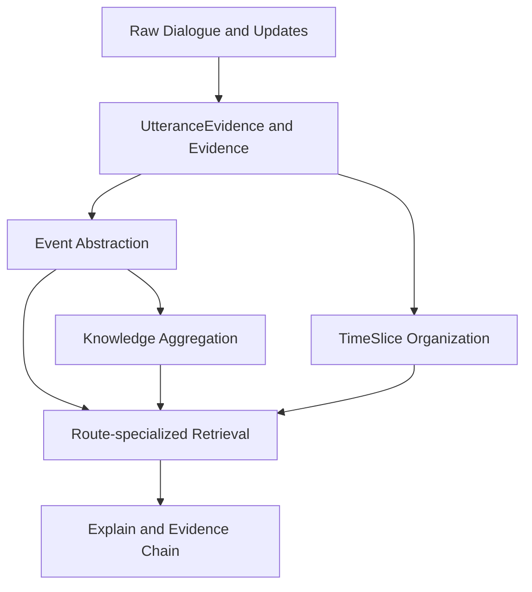
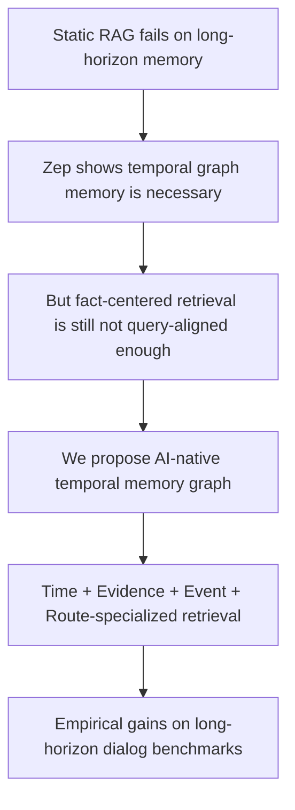

# TKG 与 Zep 对比及论文叙事方向 V2.0

> 目的：给后续论文撰写提供一份真正可用的“母稿级”叙事文档。  
> 方法：不是在上一版文档上做局部修补，而是结合 `modules/memory` 当前实现、`docs/时空知识记忆系统构建理论` 的完整理论演化轨迹，以及 Zep 原文，重建一套完整逻辑体系。  
> 范围：只讨论当前 **TKG 主线**，不讨论历史兼容层。  
> 结论先行：**我们最应该写的，不是 another temporal KG，而是一个面向 long-horizon conversational agents 的 AI-native temporal memory graph。**

---

## 0. 一句话版本

Zep 证明了“temporal knowledge graph memory”优于静态 RAG；  
我们的论文应该证明的是：

> 当记忆系统把 **时间变成可遍历维度**、把 **证据变成第一类节点**、把 **事件变成主检索单元**、并用 **问题类型驱动的多路检索编排** 取代单层 fact retrieval 时，系统会更适合 long-horizon conversational memory。

这就是 V2.0 叙事的中心。

---

## 1. 为什么必须从 Zep 讲起

如果不经过 Zep，论文会显得像“我们自己发明了一套图记忆系统”；  
但如果只是顺着 Zep 讲，又容易变成“我们也做了 temporal KG，只是节点更多”。

Zep 的价值在于，它已经把下面这件事讲清楚了：

- 传统静态 RAG 不适合 agent memory；
- 动态记忆需要 temporal graph；
- memory retrieval 不只是 vector search，而要做 graph-aware search + rerank + context construction。

所以 Zep 是一个必须经过的参照系。  
但我们不能停在 Zep 的叙事框架里。

---

## 2. Zep 论文真正讲了什么

重新读 Zep 之后，它的结构可以非常清楚地压缩成四层：

### 2.1 Zep 的问题定义

Zep 的问题定义是：

- 记忆是 continuously evolving 的；
- 企业场景下，信息来自持续对话和业务数据；
- 因此需要一个能够维护历史有效性的 temporal knowledge graph。

它对 memory 的直觉是：

- **dynamic fact memory**

### 2.2 Zep 的图结构核心

Zep 的主图分三层：

1. `Episode`
2. `Semantic Entity / Fact`
3. `Community`

它的中心对象不是事件本身，而是：

- episodes 作为原始来源
- entities / facts 作为核心语义单元
- communities 作为全局摘要单元

### 2.3 Zep 的检索核心

Zep 把检索 formalize 成：

- `search(phi)`
- `rerank(rho)`
- `constructor(chi)`

其中 search 由三类方法组成：

- cosine similarity
- BM25 full-text
- BFS graph expansion

这其实是一个非常“论文友好”的写法：  
它把 memory retrieval 说成了一个由候选召回、排序、上下文构造组成的 pipeline。

### 2.4 Zep 的真正强项

Zep 最强的并不是“图更复杂”，而是：

1. **bi-temporal modeling**
2. **fact invalidation**
3. **community abstraction**
4. **latency + token + accuracy 一体化叙事**

所以如果我们后面写论文，绝不能把它简单描述成“一个有 edges 的 graph RAG”。  
它是一套很成熟、很完整的 temporal fact memory 体系。

---

## 3. Zep 没有覆盖，或者没有作为主线优化的是什么

这一步很关键。  
不是为了挑毛病，而是为了找到我们真正应该讲的差异。

### 3.1 Zep 优先优化的是 “facts over time”，不是 “events for agent QA”

Zep 的核心问题是：

- 事实在何时生效
- 新事实如何使旧事实失效
- 如何从 episode 中提炼 entities 和 facts

而很多长时对话 benchmark 的问题，其实更像：

- 哪个事件先发生？
- 哪段原话才是正确证据？
- 这个问题需要时间窗、人物锚点，还是长期知识？
- 当前答案应该来自 event summary、utterance，还是 knowledge？

这说明：

- **Zep 优化的是 temporal truth maintenance**
- **而我们更适合优化 long-horizon conversational retrieval**

### 3.2 Zep 的 community layer 更适合“全局概览”，不一定最适合“会话级精准回忆”

community 是 Zep 的优点，但它服务的主要是：

- global abstraction
- cluster summarization
- corpus-level understanding

而 long-horizon conversational agents 的很多高频问题，需要的是：

- 局部事件顺序
- 局部证据回链
- 会话间的轻量聚合

所以在我们的故事里，community 不是必须跟进的方向。  
这不是缺失，而是目标不同。

### 3.3 Zep 的检索是 “多种搜索技术找同类对象”，我们更适合讲 “不同记忆层协同回答不同问题”

Zep 的三路 search 本质上是在不同技术上搜索：

- edges
- entities
- communities

而我们的多路检索，如果讲清楚，本质上是在不同记忆结构上搜索：

- events
- utterances
- knowledge
- entities
- timeslices

这是一条不同的思想路径。

---

## 4. 你们自己的理论轨迹，决定了论文不能只讲“工程效果”

如果只看 `modules/memory` 的代码，很容易把它理解成一个研究型 retrieval stack。  
但把 `docs/时空知识记忆系统构建理论` 读完之后，可以看到你们其实已经形成了一套很完整的理论演化链。

### 4.1 理论层给了你们真正的“第一性原理”

从 `时空知识图谱的本体论与信息论基础.md` 能看到几个关键公理：

1. 时间不是普通属性，而是需要被实体化和组织化的维度。
2. 证据、事件、状态、空间区域属于不同本体角色，不能混在一个事实层里。
3. 记忆系统不是越全越好，而要在信息损失、成本、时延之间做 tradeoff。
4. 长期记忆必须接受“实时性 / 无损性 / 可扩展性”的不可能三角。

这意味着：

- 你们的设计原点不是 “怎么做一个更花哨的 graph”
- 而是 “怎么为 agent 构造一种合适的 memory substrate”

### 4.2 规划层把理论收敛成了 AI-native memory principles

在 `AI 原生记忆图谱设计与 Agent 检索策略.md` 中，几个非常强的原则已经被明确写出来：

- temporal-first
- evidence-backed
- multi-resolution
- self-describing
- hypothesis-native
- tool-interface

这些原则里，当前最成熟、最适合写进论文的，是前四个中的前三个：

- temporal-first
- evidence-backed
- multi-resolution

而 `hypothesis-native` 和更强的状态变化能力，目前更适合作为中长期方向。

### 4.3 问题清单不是附属品，而是你们 schema 的真正设计约束

`记忆检索与推理对标清单.md` 是非常重要的一份文档。  
它表明你们的 schema 和 API 不是从数据库角度出发，而是从问题层级出发：

- L1 基础事实
- L2 时序与状态
- L3 多跳与关系
- L4 语义泛化与多模态
- L5 否定逻辑

这件事的论文价值很大，因为它意味着：

- 你们的图不是 data model first
- 而是 **query-shape first**

这恰恰是 AI-native memory graph 最重要的特征之一。

---

## 5. 因此，我们的问题定义应该怎么写

这一步是 V2.0 最关键的修正。

### 5.1 不要再写成“我们也做了 temporal knowledge graph memory”

这是不够锋利的。

因为这只会把我们放到 Zep 已经铺好的轨道里：

- dynamic memory
- temporal graph
- better than static RAG

这不是错，但不够新。

### 5.2 更准确的问题定义

我们的问题应该被写成：

> 对于 long-horizon conversational agents，仅仅把记忆建模成“随时间变化的事实图”仍然不够；系统需要一种面向检索和问答的 AI-native temporal memory graph，其中时间是可遍历维度，证据是第一类节点，事件是抽象语义边界，而不同问题类型由不同记忆子结构协同回答。

这个定义跟 Zep 的关系是：

- Zep 解决了 temporal graph memory 的可行性；
- 我们进一步解决 **temporal graph memory 如何更适合 long-horizon conversational retrieval**。

### 5.3 用一句更短的话概括

Zep 的问题是：

- **How do we maintain dynamic temporal facts?**

我们的问题是：

- **How should an agent retrieve, ground, and reason over long-horizon temporal memory?**

这就是两篇 paper 的真正差异。

---

## 6. 当前 TKG 应该被如何理解

结合代码和理论文档，当前 TKG 最准确的理解方式不是 “typed graph”，而是下面这套结构：

### 6.1 Evidence-first

文本对话 TKG 管线已经明确了：

- turn 不是 event
- turn 首先写成 `UtteranceEvidence`
- event 是在证据层之上的抽象语义单元

这意味着系统保留了一个非常重要的能力：

- **答案可以回链到原始证据，而不是停在摘要上**

### 6.2 Event as abstraction boundary

`Event` 的价值不是“多一个节点类型”，而是作为 abstraction boundary：

- 它把局部证据聚合成 agent 可消费的语义单元；
- 但又不把证据彻底丢掉。

这正好避免了两种极端：

- 只存原话，难以抽象
- 只存 facts，丢失证据细节

### 6.3 Time as traversable dimension

从理论文档到 schema 文档，再到检索实现，时间都不是一个“附属字段”：

- `TimeSlice`
- `time_route`
- `query_events` / 时间范围过滤
- `NEXT_EVENT` / 时间顺序

这些共同说明：  
你们当前 TKG 的时间不是 metadata-only，而是 retrieval structure。

### 6.4 Multi-resolution memory

当前设计里已经存在非常清楚的层级：

- 原始证据层
- 事件层
- 知识层
- 时间组织层

这比 “episode + fact + community” 更适合写成：

- **multi-resolution conversational memory**

这也是 AI-native 的另一部分含义。

---

## 7. 与 Zep 的最准确对比，不应该是“谁的图更复杂”，而应该是“谁为哪类问题优化”

### 7.1 Head-to-head 对比表

| 维度 | Zep | 我们当前 TKG |
|---|---|---|
| 核心问题 | dynamic temporal fact memory | long-horizon conversational memory retrieval |
| 图主对象 | episode, entity, fact, community | utterance evidence, event, knowledge, timeslice, entity |
| 时间角色 | fact validity / invalidation | retrieval dimension + event ordering + time anchoring |
| 证据角色 | episode as source | evidence as first-class retrieval anchor |
| 检索对象 | edges, entities, communities | events, utterances, knowledge, entities, timeslices |
| 检索编排 | hybrid search over graph objects | route-specialized retrieval over memory layers |
| 最强卖点 | temporal truth maintenance | query-aligned, evidence-grounded event retrieval |
| 更适合的场景 | enterprise temporal fact systems | long-horizon conversational agents |

### 7.2 关键差异的正确表述

不要写：

- 我们的图比 Zep 更高级

应该写：

- Zep 和我们优化的是不同层级的问题；
- Zep 解决的是 “graph memory as temporal fact maintenance”；
- 我们解决的是 “graph memory as AI-native retrieval substrate for agents”。

### 7.3 Community 不是我们的短板，而是我们当前问题定义下的非核心项

如果审稿人或读者问：

- 你们为什么没有 community layer？

最好的回答不是解释“以后会做”，而是直接讲：

- 我们当前优化目标是 long-horizon conversational retrieval；
- 对这类问题，局部事件、局部证据和时间锚定的价值，当前高于全局 community summarization。

这会比“我们暂时没做”更强。

---

## 8. 现在最能支撑 benchmark 提升的理论命题是什么

这里必须非常克制。  
论文里最重要的不是“把所有优点都写进去”，而是抓住最能被实验支撑的那几条。

### 命题一：时间实体化会提升 temporal reasoning

如果时间只是 metadata，系统主要依赖 embedding 去“猜时间关系”；  
如果时间是：

- `TimeSlice`
- `time_route`
- 事件时间顺序

那么 temporal questions 就可以通过结构化检索直接被约束。

这解释了为什么 time-sensitive benchmark 更可能受益。

### 命题二：Evidence-grounding 会提升 preference、assistant recall 和高难时间题

很多对话记忆问题的答案不是“高层摘要”，而是：

- 某句原话
- 某次更新
- 某个带时间表达的局部叙述

`UtteranceEvidence + explain chain` 的价值就在于减少 semantic compression loss。

### 命题三：Event-centered abstraction 比 fact-centered retrieval 更贴近对话问答

对话里的很多问题，主索引单位应该是 event，而不是 atomized facts。  
因为问答经常依赖：

- event ordering
- event participation
- event-local evidence

这比只在 fact 层打分更贴近 benchmark 的问题分布。

### 命题四：Route specialization 比 monolithic hybrid search 更适合 heterogeneous memory questions

不同问题需要的“记忆入口”不一样：

- 时间题先走 time route
- 人物题先走 entity route
- 原话题更依赖 utterance route
- 事实归纳题更依赖 knowledge route

这说明 memory retrieval 的本质不只是“多搜几次”，而是：

- **针对问题类型，访问不同记忆层**

### 命题五：Benchmark-to-runtime alignment 可以减少 evaluation drift

你们仓库里已经有多组 prompt / rerank / QA 对齐测试。  
这意味着：

- benchmark 不是完全靠一套单独 adapter 跑出来的；
- 运行时链路和 benchmark 链路之间有实质性收敛。

这在论文里会是一个很好的 credibility point。

---

## 9. 但什么不应该被放在当前论文的中心

这一步和上面同样重要。

### 9.1 `State` 不应该成为主贡献

原因不是它不重要，而是：

- 当前它是 schema-level strength
- 不是最稳的 empirical driver

所以 `State` 适合在 paper 里这样出现：

- 作为 architecture extension
- 作为下一阶段能力
- 作为 long-term roadmap

但不要把它当成当前结果最核心的解释器。

### 9.2 不要和 Zep 正面对打 temporal invalidation

Zep 在这个点上讲得更干净：

- `valid_at`
- `invalid_at`
- `created_at`
- `expired_at`
- contradiction-based invalidation

我们现在更适合讲：

- retrieval alignment
- evidence grounding
- event-centric design

### 9.3 不要把内部 benchmark 直接写成硬 SOTA claim

当前内部结果当然很强，但设置仍然不完全等价：

- LongMemEval oracle subset vs Zep 的 LongMemEvals
- QA 模型不同
- judge 与 token budget 不同

所以现在最稳的写法是：

- **directional superiority signal**

而不是：

- strict leaderboard claim

---

## 10. Benchmark 故事应该怎么重写

这部分是上一版最需要升级的地方。

### 10.1 DMR 不应该成为我们论文的重心

这一点其实 Zep 自己都已经承认了：

- DMR 太短
- full-context baseline 已经很强
- 它更像历史 benchmark，而不是能区分 memory architecture 的强 benchmark

所以如果我们写论文，DMR 最多做：

- 背景性引用
- historical baseline reference

而不是主实验中心。

### 10.2 真正的重点应该是 LongMemEval + LoCoMo + 消融实验

因为这两类 benchmark 更贴近我们最强的能力：

- 长时对话
- 时间推理
- 多跳
- 证据回链
- 个性化记忆

### 10.3 当前可用的内部证据应该怎样写

推荐写法：

| 结果 | 证据定位 |
|---|---|
| LongMemEval oracle subset `82.0%` | 强方向性信号 |
| LoCoMo conv-26 `93.47%` | 强 E2E 效果信号 |
| alignment tests | 方法稳定性和评测可信度信号 |

不推荐写法：

- “我们严格意义上全面超过 Zep”

推荐写法：

- “在内部长时对话评测中，我们观察到显著强于 Zep 论文报告值的结果；这与我们的时间原生、证据驱动、事件中心检索设计一致，但仍需在统一设置下做进一步对齐实验。”

---

## 11. 这篇论文最好的标题、摘要和引言方向

### 11.1 最推荐的标题

我现在最推荐两个版本：

1. **AI-Native Temporal Memory Graphs for Long-Horizon Conversational Agents**
2. **Event-Centric and Evidence-Grounded Temporal Memory for LLM Agents**

如果要更偏理论，选第 1 个。  
如果要更偏工程和 benchmark，选第 2 个。

### 11.2 最推荐的摘要主句

英文：

> We present an AI-native temporal memory graph in which time is a traversable retrieval dimension, evidence is a first-class node type, and event-centered multi-route retrieval replaces monolithic fact retrieval for long-horizon conversational agents.

中文：

> 我们提出一种 AI-native 时序记忆图谱，其中时间是可遍历的检索维度，证据是第一类节点，检索以事件为中心并采用多路协同，而不是单层事实召回，以更好地服务长时对话型 agent。

### 11.3 引言的最佳推进方式

引言不应该从“我们系统有很多节点类型”开始；  
应该从“现有 temporal memory 还不够 query-aligned”开始。

---

## 12. Method section 应该长什么样

如果按论文结构写，最推荐的 Method 章节可以分成四小节：

### 12.1 AI-Native Temporal Memory Graph

讲清楚三件事：

- time as traversable dimension
- evidence as first-class nodes
- multi-resolution memory hierarchy

### 12.2 Event-Centered Abstraction

讲清楚：

- turn 不是 event
- utterance is evidence
- event 是 evidence 之上的抽象语义边界

### 12.3 Route-Specialized Retrieval

讲清楚：

- `event_vec`
- `utterance_vec`
- `knowledge`
- `entity`
- `time`
- RRF + recency + explain

### 12.4 Evidence-Grounded Construction for QA

讲清楚：

- 检索结果如何通过 explain 回链到 evidence
- 为什么这能降低 semantic compression loss

---

## 13. 论文里必须补的 4 组实验

没有这些实验，paper 可以写，但说服力不够顶。

### 13.1 Ablation A: remove `time_route`

目标：

- 验证 temporal reasoning 提升是否真的来自时间原生检索

### 13.2 Ablation B: remove explain / utterance grounding

目标：

- 验证 evidence-grounding 是否真能提升高难对话题

### 13.3 Ablation C: replace multi-route retrieval with monolithic hybrid retrieval

目标：

- 验证 route specialization 是否是核心贡献

### 13.4 Ablation D: event-only vs fact-only retrieval view

目标：

- 验证 event-centered retrieval 是否真的比纯 fact-style retrieval 更贴近长时对话问答

这一组实验会非常强，因为它是和 Zep 思想差异最直接的桥。

---

## 14. 可写进论文的 claim ladder

### 14.1 安全 claim

这些可以放心写：

1. 我们提出了 AI-native temporal memory graph。
2. 时间被实现为可遍历的检索维度，而不是仅作元数据。
3. 证据被建模为第一类节点，并可回链到原话/原始证据。
4. 检索以事件为中心，采用多路编排，而不是单一路径 fact retrieval。
5. benchmark 与运行时链路高度对齐。

### 14.2 需要实验支持的 claim

1. 这种设计更适合 long-horizon conversational memory。
2. 它能显著提升 temporal reasoning 与 evidence-grounded QA。
3. 它比 fact-centered temporal retrieval 更 query-aligned。

### 14.3 当前不建议写成硬 claim

1. 我们在 temporal truth maintenance 上全面超越 Zep。
2. 我们的状态更新机制已经系统性优于 bi-temporal invalidation。
3. 我们已经严格意义上 SOTA。

---

## 15. 这份 V2.0 文档给出的最终判断

### 15.1 最准确的自我定位

你们当前最适合的定位不是：

- “另一个 temporal KG service”

而是：

- **一个面向 long-horizon conversational agents 的 AI-native temporal memory retrieval substrate**

### 15.2 最准确的与 Zep 的关系

不是：

- 我们把 Zep 全面替代了

而是：

- Zep 把 dynamic temporal fact memory 讲清楚了；
- 我们进一步把 temporal memory graph 推向了 query-aligned、evidence-grounded、event-centered 的 agent retrieval substrate。

### 15.3 最准确的论文主轴

不是：

- 我们比 Zep 多了多少节点类型

而是：

- **为什么 long-horizon conversational memory 需要一种 AI-native temporal memory graph**

只要这条主线抓住了，后面的 architecture、benchmark、消融实验都会自然落到位。

---

## 16. 附录：这份 V2.0 的主要依据

### 16.1 当前实现

- `modules/memory/contracts/graph_models.py`
- `modules/memory/application/graph_service.py`
- `modules/memory/retrieval.py`
- `modules/memory/infra/neo4j_store.py`

### 16.2 理论与规划轨迹

- `docs/时空知识记忆系统构建理论/README.md`
- `docs/时空知识记忆系统构建理论/1. 理论层（Why & What）/时空知识图谱的本体论与信息论基础.md`
- `docs/时空知识记忆系统构建理论/2. 规划层（How over time）/AI原生记忆图谱设计与检索策略.md`
- `docs/时空知识记忆系统构建理论/2. 规划层（How over time）/AI_Memory_Infrastructure_Blueprint.md`
- `docs/时空知识记忆系统构建理论/2. 规划层（How over time）/记忆检索与推理对标清单.md`
- `docs/时空知识记忆系统构建理论/3. Schema 层（What exactly in code）/TKG-Graph-v1.0-Ultimate.md`
- `docs/时空知识记忆系统构建理论/5. 文本层设计/文本对话TKG管线说明.md`
- `docs/时空知识记忆系统构建理论/8. Python SDK 、api 、mcp设计/TKG_能力收敛与语义API施工标准.md`

### 16.3 内部 benchmark 与对齐证据

- `modules/memory/outputs/e2e_conv26_grok_para20_top30_01/aggregate_conv-26.json`
- `benchmark/outputs_legacy_archive/8. longmemeval_oracle_subset_grok4.1/summary.json`
- `modules/memory/tests/unit/test_dialog_fact_extractor_prompt_alignment.py`
- `modules/memory/tests/unit/test_dialog_qa_prompt_alignment.py`
- `modules/memory/tests/unit/test_dialog_rerank_service_alignment.py`

