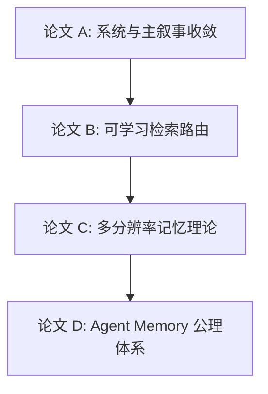
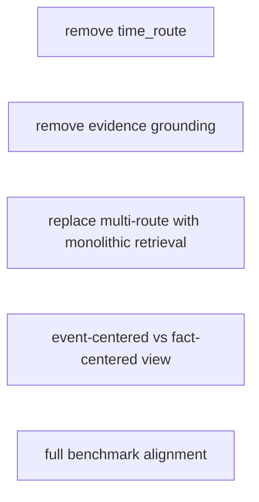
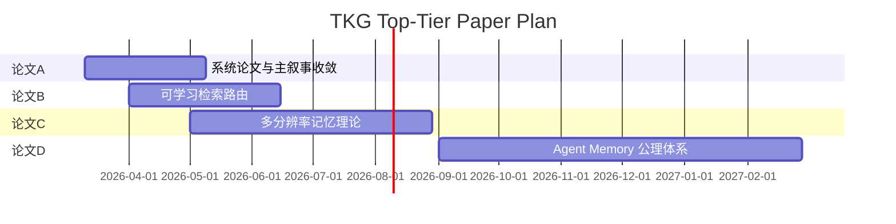

# TKG 顶会论文规划路线图

> 目的：基于当前 `modules/memory` 与 TKG 理论体系，规划一条 **收益更大、理论更优雅、且可持续产出** 的顶会论文路线。  
> 背景：当前系统已经具备真实工程基础、可运行 benchmark、清晰的理论演化文档，以及一条可以继续抽象为研究问题的架构主线。  
> 核心目标：从“我们做出了一个强系统”升级为“我们回答了这个领域里值得发顶会的问题”。

---

## 0. 执行摘要

如果只从论文收益、可行性和长期价值三个维度综合考虑，我建议把未来 1 年拆成三层：

### 推荐优先级

1. **论文 A：系统论文 + 完整消融 + 统一叙事**
2. **论文 B：检索路由作为 contextual bandit / learning-to-route**
3. **论文 C：多分辨率记忆的信息论框架**
4. **论文 D：Agent Memory 公理体系**

### 原因

- 论文 A 负责把当前成果变成“可投稿”的稳定输出；
- 论文 B 最接近你们现有实现，投入小、创新足、见效快；
- 论文 C 最能成为长期理论支柱，但需要额外数学工作；
- 论文 D 最有野心，也最危险，不适合作为当前第一篇。

一句话建议：

> **短期先发“能站住”的系统与方法论文，中期补“可学习”与“信息论”支柱，长期再定义领域。**

---

## 1. 当前系统到底适合支撑什么级别的论文

当前 `modules/memory` 已经具备以下几个非常稀缺的条件：

### 1.1 工程侧条件

- 有真实可运行的 memory service，而不是只停留在 notebook
- 有 typed TKG schema、文本对话 TKG 管线、多路检索编排
- 有 LoCoMo / LongMemEval 方向的 benchmark 产物
- 有 prompt / QA / rerank 的 benchmark 对齐测试
- 有理论演化文档，不是纯事后总结

### 1.2 理论侧条件

- 时间实体化
- 证据一等公民
- 多分辨率记忆层
- query-shape first 的 schema 设计
- route-specialized retrieval 的雏形

### 1.3 这意味着什么

你们现在已经不只是“能写系统报告”，而是已经具备发下面三类论文的基础：

1. **系统论文**
2. **学习型检索方法论文**
3. **理论框架论文**

但还不够安全去直接写：

4. **领域公理论文**

因为第 4 类论文需要的不只是一个强系统，而是对整个 agent memory 领域有足够稳定的抽象能力。

---

## 2. 四条论文方向的定位与价值

下面我按“最近、中期、长期”来重新整理你给出的四条方向。

---

## 3. 方向 A：系统论文

> 这是保底线，也是所有后续论文的公共母体。

### 3.1 论文问题

当前 temporal graph memory 系统已经证明图结构优于静态 RAG，但 long-horizon conversational agents 仍需要一种：

- time as traversable dimension
- evidence as first-class nodes
- event-centered abstraction
- multi-route retrieval

的 AI-native temporal memory graph。

### 3.2 核心主张

这篇论文不追求最激进的理论创新，而追求：

- 问题定义比现有系统更准确
- 架构设计比现有工作更清楚
- benchmark 与 runtime 对齐更强
- 消融足够完整

### 3.3 最适合的标题方向

1. **AI-Native Temporal Memory Graphs for Long-Horizon Conversational Agents**
2. **Event-Centric and Evidence-Grounded Temporal Memory for LLM Agents**

### 3.4 必须回答的三个 why

1. 为什么时间不能只是 metadata？
2. 为什么事件和证据要分层？
3. 为什么多路检索比单路 hybrid retrieval 更适合 heterogeneous memory questions？

### 3.5 必须补的实验

最少需要：

- 去掉 `time_route`
- 去掉 `UtteranceEvidence / explain`
- 把 `dialog_v2` 降级为单路 hybrid retrieval
- 比较 event-centered retrieval 与 fact-only retrieval view

### 3.6 风险

- 如果只写系统效果，没有足够清晰的问题定义，会被审稿人看成“another graph memory system”
- 如果只写 benchmark，没有消融，会被看成 heuristic engineering

### 3.7 适合投稿

- **ACL / EMNLP 主会或 Findings**
- 如果实验极强、理论 framing 足够好，也可以试 ICLR

### 3.8 时间预算

- 4-8 周

### 3.9 收益

- 立刻形成第一篇稳定产出
- 给后续所有方法与理论论文提供统一架构与 benchmark 语境

---

## 4. 方向 B：检索路由作为 Contextual Bandit

> 这是我认为“投入产出比最高”的方法论文方向。

### 4.1 问题定义

当前 `dialog_v2` 已经有多条记忆检索路由：

- `event_vec`
- `utterance_vec`
- `knowledge`
- `entity`
- `time`

但所有 query 共享同一组手工权重。  
这和你们自己的分析冲突，因为：

- 时间题更应该重 `time_route`
- 偏好题更应该重 `utterance` / `knowledge`
- 多跳题更应该重 `entity` / graph expansion

所以自然问题是：

> **memory retrieval routing 能否从 query context 中自动学习？**

### 4.2 形式化

把问题写成：

- context `x`：query embedding + detected entities + temporal hints + lexical cues
- action `a`：路由权重向量 `w`
- reward `r`：answer correctness / judge score / retrieval quality

目标：

- 学习策略 `pi(w|x)`，最大化期望奖励

### 4.3 为什么这个方向非常好

1. **离当前系统最近**
   你们已经有：
   - 路由
   - 权重
   - benchmark
   - 外部可传权重接口

2. **学术上是干净的 ML 问题**
   从 heuristic routing → learnable routing，是审稿人非常熟悉也很认可的升级路径。

3. **实验很好做**
   benchmark 本身就能提供离线训练信号；
   之后还能自然扩展到线上 A/B。

### 4.4 论文核心主张

最稳的版本：

> Query-conditioned routing significantly outperforms fixed retrieval weights for heterogeneous memory questions.

更强一点的版本：

> Memory route selection is naturally a contextual bandit problem, and learnable routing yields higher answer quality with bounded exploration cost.

### 4.5 理论部分可以做到什么程度

最保守可做：

- 问题 formalization
- 简单 regret 分析
- offline contextual bandit evaluation

更强可做：

- 连续动作空间（权重分配）下的 regret bound
- constrained bandit（兼顾 latency / token budget）

### 4.6 必要实验

1. 固定权重 baseline
2. oracle-per-task 权重 upper bound
3. contextual bandit learned policy
4. latency / token / quality tradeoff

### 4.7 风险

- 如果只是训练一个小分类器预测题型，创新度不够
- 如果理论部分过弱，会像工程小改进

### 4.8 适合投稿

- **ACL / EMNLP 主会**
- 如果理论写得漂亮，可以试 NeurIPS workshop 或主会边缘

### 4.9 时间预算

- 工程 1-2 周
- 实验 2-3 周
- 理论 2-4 周

### 4.10 收益

- 最有希望在短期内发出一篇“方法论文”
- 直接证明你们系统不是纯 heuristic

---

## 5. 方向 C：多分辨率记忆的信息论框架

> 这是最优雅、最有长期支柱价值的理论方向。

### 5.1 为什么这个方向很强

当前整个记忆系统里，最独特也最有可理论化潜力的地方，不只是 event-centric，而是：

- **你们维护了同一段对话在不同压缩粒度下的表示**

例如：

- `UtteranceEvidence`：近似无损
- `Event`：中等压缩
- `Knowledge`：高度压缩

这是一个非常自然的“多分辨率记忆”结构。

### 5.2 核心研究问题

> 单一分辨率的记忆系统，是否在异构查询分布下必然劣于自适应多分辨率记忆？

这句话一旦被证明，就非常强。

### 5.3 理论骨架

设对话历史为 `H`，  
记忆系统在不同 resolution 下给出：

- `M_raw(H)`
- `M_event(H)`
- `M_knowledge(H)`

满足：

- 信息量递减
- 检索成本递减

对查询 `q`，定义不同 resolution 下的 retrieval error：

- `epsilon_r(q)`

再定义 adaptive strategy：

- `r*(q)`

核心命题可以写成：

> For heterogeneous query distributions, no single-resolution memory representation is uniformly optimal; adaptive multi-resolution retrieval achieves lower expected error under the same or lower effective budget.

### 5.4 为什么这是顶会级问题

因为它把一个工程观察升级成了：

- **带 impossibility flavor 的理论命题**

而且它直接连接：

- rate-distortion theory
- adaptive computation
- information bottleneck
- retrieval under heterogeneous queries

### 5.5 实验如何自然接上

你们的消融几乎天然就是验证手段：

1. 只保留 `UtteranceEvidence`
2. 只保留 `Event`
3. 只保留 `Knowledge`
4. adaptive multi-resolution retrieval

再按 query type 分析：

- 哪些题需要 raw
- 哪些题 event 足够
- 哪些题 knowledge 最合适

### 5.6 风险

- 需要真正的数学合作者
- 如果推导不到位，就会变成“直觉很好，但不够严谨”
- 时间周期更长

### 5.7 适合投稿

- **NeurIPS / ICML / ICLR**

### 5.8 时间预算

- 2-4 个月

### 5.9 收益

- 一旦成立，就是你们整个研究方向最强的理论支柱
- 后面所有系统和方法论文都可以挂在这个理论框架上

---

## 6. 方向 D：Faithfulness / Evidence Grounding 理论

> 这是理论门槛较低、但和当前系统结合非常紧密的一条线。

### 6.1 核心问题

为什么 evidence-grounded retrieval 是必要的？  
更准确地说：

> 在什么类型的问题上，summary-only retrieval 必然会产生比 evidence-grounded retrieval 更大的误差？

### 6.2 为什么这条线适合你们

因为你们当前系统已经天然有两种 view：

- summary-style view：`Event` / `Knowledge`
- evidence-grounded view：`UtteranceEvidence` / explain chain

这意味着这条论文不需要先发明系统，而是可以直接围绕现有系统展开。

### 6.3 理论切口

可以定义：

- answer granularity
- summary compression level
- grounding gap

然后研究：

- 当答案依赖于精确措辞、数字、日期、偏好表达时，
- summary 会在哪些情况下丢失 answer-critical information

命题风格不一定要很重数学，但至少可以做到：

- formal definitions
- error decomposition
- query type taxonomy

### 6.4 必要实验

1. summary-only vs evidence-grounded
2. 按 query 类型分层：
   - preference
   - temporal
   - numeric/date
   - assistant self-recall
3. 对 grounding gap 做 error analysis

### 6.5 风险

- 如果 formalization 太弱，会被看成 “一个合理的经验观察”
- 如果实验分类不够细，结论会很松

### 6.6 适合投稿

- **ACL / EMNLP**
- 如果 framing 非常漂亮，也可以试 ICLR

### 6.7 时间预算

- 4-8 周

### 6.8 收益

- 这是最容易和当前系统强绑定、同时又不只是系统工程的一篇论文
- 可以和系统论文共生，也可以独立成篇

---

## 7. 方向 E：Agent Memory 公理体系

> 这是最有野心的方向，但现在不该作为第一优先级。

### 7.1 核心问题

Agent memory system 到底应该满足哪些公理性质，才能被认为是“正确的”？

你已经提出了一个非常强的雏形：

- Temporal Consistency
- Evidence Completeness
- Resolution Adaptivity
- Forgetting Soundness

这非常像：

- 数据库里的 ACID
- 分布式系统里的 CAP

### 7.2 这篇论文如果做成，会非常强

因为它不只是在解决一个系统问题，而是在：

- **定义整个领域的设计空间**

### 7.3 但为什么现在不建议先做

因为这类论文的失败方式也很明确：

- 如果形式化稍微不够严谨，就会被打成“philosophy, not science”
- 如果对比系统覆盖不够全面，就会显得只是在总结自家系统

### 7.4 最好的时机

等到下面这些都具备后再做更稳：

1. 至少一篇系统论文已发表
2. 至少一篇方法或理论论文已发表
3. 对 Zep / MemGPT / GraphRAG / 你们自己都有足够扎实的第一手理解

### 7.5 适合投稿

- **ICML / NeurIPS / ICLR**

### 7.6 时间预算

- 4-6 个月起步

### 7.7 收益

- 一旦成功，这会是“高引用框架论文”
- 但不适合作为当前的第一篇或第二篇

---

## 8. 推荐的 1 年论文组合打法

### 8.1 总体路线

### 8.2 最推荐的具体排期

| 时间 | 论文 | 方向 | 目标 |
|---|---|---|---|
| 现在 - 2 个月 | 论文 A | 系统论文 | 快速形成稳定产出 |
| 1 - 3 个月 | 论文 B | Contextual Bandit Routing | 方法创新，证明不是 heuristic |
| 2 - 6 个月 | 论文 C | 多分辨率信息论 | 长期理论支柱 |
| 6 - 12 个月 | 论文 D | 公理体系 | 领域定义级工作 |

---

## 9. 我给出的明确优先级建议

### 第一优先级：论文 A

原因：

- 你们已经最接近完成
- 能把现有成果转成正式学术资产
- 没有 A，后面 B/C 的叙事语境会弱很多

### 第二优先级：论文 B

原因：

- 工程改造小
- 学术问题清晰
- 很容易体现 “not heuristic anymore”

### 第三优先级：论文 C

原因：

- 长期价值极高
- 但需要额外理论合作者和更长周期

### 第四优先级：论文 D

原因：

- 最有野心
- 但需要在这个方向上先积累 1-2 篇已站住的工作

---

## 10. 每篇论文的成功标准

### 论文 A 成功标准

- benchmark + 消融完整
- 问题定义锋利
- 和 Zep 的差异不是“多几个组件”，而是“不同 retrieval substrate”

### 论文 B 成功标准

- learned routing 显著优于 fixed routing
- latency / token / quality tradeoff 讲清楚
- 有基本理论支撑，不只是小模型调参

### 论文 C 成功标准

- 真正写出 formal framework
- 最好至少有一个 theorem / bound
- 消融与理论对应关系足够自然

### 论文 D 成功标准

- 公理定义真正普适
- 有 clear tradeoff theorem 或 impossibility result
- 对现有系统的 mapping 不是拍脑袋

---

## 11. 资源配置建议

### 11.1 最理想的分工

| 角色 | 负责 |
|---|---|
| 系统负责人 | 论文 A 主写，补 benchmark 与消融 |
| 方法负责人 | 论文 B，改造路由学习框架 |
| 理论合作者 | 论文 C，多分辨率信息论框架 |
| 首席研究者 | 论文 D，长期抽象与领域框架 |

### 11.2 如果人手有限

那就只做：

1. 论文 A
2. 论文 B

并把论文 C 作为并行预研，不强求立刻投稿。

---

## 12. 最终建议

如果只给一个最实际的建议，我会这样说：

> 先用论文 A 把当前系统沉淀成一篇站得住的系统论文；  
> 紧接着做论文 B，把检索路由从 heuristic 提升为可学习算法；  
> 同时启动论文 C，把多分辨率记忆这件事真正推到理论层。  
> 至于论文 D，等前三者把“系统、方法、理论”三条线都站稳之后，再来定义整个领域。

你们现在缺的不是系统，而是：

- 一个能先发出来的稳论文
- 一个能证明“不是经验主义”的方法论文
- 一个能给整个方向撑起上限的理论框架

这三件事，论文 A/B/C 正好对应。

