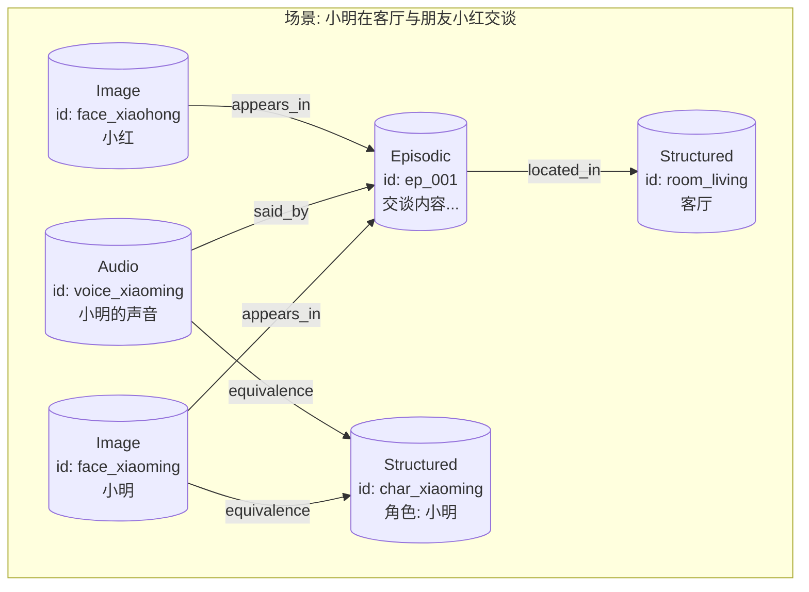

### **记忆模块（Memory System）分析报告**

#### **一、 设计哲学与核心架构**

系统遵循先进的 **六边形架构（Hexagonal Architecture）**，也称为“端口与适配器”模式，实现了核心业务逻辑与外部基础设施的完美解耦。

1.  **端口 (Port):**
    *   定义在 [`memory_port.py`](MOYAN_Agent_Infra/modules/memory/ports/memory_port.py:13) 中的 `MemoryPort` 协议，是系统唯一的公共入口。它定义了 `search`, `write`, `update`, `delete`, `link` 等标准操作，为所有上层应用（如 Control Agent, Memorization Agent）提供了稳定、统一的交互契约。

2.  **应用核心 (Application Core):**
    *   [`service.py`](MOYAN_Agent_Infra/modules/memory/application/service.py:32) 中的 `MemoryService` 类是架构的核心。它编排了所有复杂的业务逻辑，如数据校验、丰富化（Enrichment）、去重合并、多阶段召回重排（Re-ranking）以及安全策略等，但它自身不依赖任何具体的数据库实现。

3.  **适配器 (Adapters):**
    *   **输入适配器 (Inbound):** [`profiles.py`](MOYAN_Agent_Infra/modules/memory/application/profiles.py) 和 [`m3_adapter.py`](MOYAN_Agent_Infra/modules/memory/adapters/m3_adapter.py:8) / [`mem0_adapter.py`](MOYAN_Agent_Infra/modules/memory/adapters/mem0_adapter.py:8) 将来自不同数据源（如 `m3` 视频分析、`mem0` 对话事实、`ctrl` 控制事件）的异构数据，统一转换为标准的 `MemoryEntry` 和 `Edge` 模型（定义于 [`memory_models.py`](MOYAN_Agent_Infra/modules/memory/contracts/memory_models.py:8)）。
    *   **基础设施适配器 (Outbound):** `infra/` 目录下的 [`qdrant_store.py`](MOYAN_Agent_Infra/modules/memory/infra/qdrant_store.py:16)、[`neo4j_store.py`](MOYAN_Agent_Infra/modules/memory/infra/neo4j_store.py:7) 分别实现了与 Qdrant（向量大脑）和 Neo4j（关系大脑）的通信，将核心层的指令转化为具体的数据库操作。

这种架构带来了极高的 **可扩展性** 和 **可维护性**。未来若想替换向量数据库或增加新的记忆来源，只需更换或添加相应的适配器，而无需改动核心业务逻辑。

#### **二、 核心特性与功能实现**

系统提供了一套完整的、面向 Agent 场景的记忆管理能力。

1.  **混合存储引擎:**
    *   **Qdrant (向量大脑):** 存储所有记忆条目（`MemoryEntry`）的向量表示，负责高效的、基于语义相似度的模糊查找（ANN）。支持文本、图像、音频等多种模态的向量集合。
    *   **Neo4j (关系大脑):** 存储实体与事件之间的关系图谱（`Edge`），负责精确的、基于关系的邻域查询与多跳联想。

2.  **高级混合式召回 (Hybrid Search & Re-ranking):**
    *   这是系统的“皇冠明珠”。一次 `search` 调用会触发一个精密的四阶段重排流程（见 [`service.py:search`](MOYAN_Agent_Infra/modules/memory/application/service.py:193)），将不同维度的“信号”融合成一个最终排序：
        *   **α (alpha) - 向量相似度:** 来自 Qdrant 的核心语义匹配分数。
        *   **β (beta) - 关键词匹配 (BM25):** 对向量召回结果进行关键词匹配打分，弥补向量模型对低频、精确术语不敏感的缺陷。
        *   **γ (gamma) - 图关系支持度:** 如果一个记忆节点在关系图谱中被其他重要节点所连接，它的分数会得到提升。支持多跳（multi-hop）路径加权。
        *   **δ (delta) - 时间衰减 (Recency):** 最近发生的记忆比久远的记忆拥有更高的权重，符合人类记忆的艾宾浩斯遗忘曲线。
    *   所有权重（α, β, γ, δ）均在 [`memory.config.yaml`](MOYAN_Agent_Infra/modules/memory/config/memory.config.yaml:76) 中可配，并支持通过 API ([`runtime_config.py`](MOYAN_Agent_Infra/modules/memory/application/runtime_config.py)) 进行 **热更新**，便于在线调优。

3.  **智能写入与去重:**
    *   `write` 操作并非简单的插入。它会执行一个“**查询-决策-合并**”流程（见 [`service.py:write`](MOYAN_Agent_Infra/modules/memory/application/service.py:408)）。
    *   当新记忆进入时，系统会先搜索相似的旧记忆。然后，通过可插拔的 `update_decider`（可由 LLM 实现）或默认的启发式规则，决定是 **新增(ADD)**、**更新(UPDATE)**、**忽略(NONE)** 还是 **删除(DELETE)** 旧记忆，有效避免了信息冗余。

4.  **全面的可观测性 (Observability):**
    *   **健康检查:** `/health` API ([`server.py:118`](MOYAN_Agent_Infra/modules/memory/api/server.py:118)) 可实时检测 Qdrant 和 Neo4j 的连通性。
    *   **Metrics 监控:** `/metrics_prom` API ([`server.py:128`](MOYAN_Agent_Infra/modules/memory/api/server.py:128)) 暴露了符合 Prometheus 格式的详细指标，如请求延迟、缓存命中率、错误数、熔断次数等，为性能分析和告警提供了坚实基础。
    *   **审计日志:** [`audit_store.py`](MOYAN_Agent_Infra/modules/memory/infra/audit_store.py:9) 记录每一次写操作（增、删、改、关联），为问题追溯和数据回滚提供了可能。

5.  **企业级可靠性设计:**
    *   **重试与退避:** 对 Qdrant 和 Neo4j 的调用失败后，会自动进行指数退避重试，应对网络抖动。
    *   **熔断机制 (Circuit Breaker):** 当后端服务连续失败达到阈值时，会自动“熔断”，在一段时间内直接拒绝请求，避免雪崩效应，保护系统整体稳定性。
    *   **安全策略:** 对 `delete` (硬删除) 和 `link` (敏感关系) 等危险操作，设计了二次确认机制（[`service.py:set_safety_policy`](MOYAN_Agent_Infra/modules/memory/application/service.py:95)），防止误操作。

#### **三、 记忆的图结构设计**

系统的关系大脑（Neo4j）构建了一个灵活且强大的实体-事件知识图谱。

*   **核心节点类型:**
    *   `Entity`: 所有节点的基类，拥有唯一的 `id` 属性。
    *   `Episodic`: 情节记忆节点，描述一个具体的事件或场景（如“小明在客厅打开了灯”）。
    *   `Semantic`: 语义记忆节点，描述一个事实、概念或实体（如“小明”、“客厅的灯”）。
    *   `Image`, `Voice`, `Structured`: `Semantic` 的子类型，用于区分不同模态的实体。

*   **核心关系类型 (Relationship):**
    *   `appears_in`: 实体（如人脸）出现在某个情节中。
    *   `said_by`: 某个声音（说话人）在情节中发言。
    *   `located_in`: 某个事件或物体位于某个地点。
    *   `executed`: 某个设备执行了某个动作。
    *   `describes`: 语义知识描述或总结了某个情节。
    *   `equivalence`: 两个节点在语义上等价（如 `face_id_123` 等价于 `character_小明`）。
    *   `prefer`: 用户对某事物有偏好。

下面是一个典型的场景图结构示例：

这个图结构清晰地表达了“**谁(who)**、在**哪里(where)**、**做什么(what)**”的核心信息，并能通过 `equivalence` 关系将多模态的感知（人脸、声音）聚合到统一的身份上。

#### **四、 召回机制与效果分析**

召回效果是记忆系统价值的最终体现。本系统通过 **多路召回 + 融合排序** 的机制，实现了兼具 **广度** 和 **精度** 的召回能力。

1.  **召回广度 (Recall):**
    *   第一阶段，系统使用 **向量检索** 从数以万计的记忆中，快速捞出在语义上最相关的 Top-K 个候选条目。这个阶段保证了即使查询语句与原文不完全匹配（如“喜欢的水果” vs “爱吃苹果”），也能被找回。

2.  **召回精度 (Precision):**
    *   第二阶段，系统对这 Top-K 个候选条目进行精细化的 **重排序 (Re-ranking)**，提升最相关条目的排名。
    *   **BM25** 算法会惩罚那些仅语义相关但缺少关键词重叠的条目。
    *   **图扩展** 会给那些与“上下文”中其他重要实体（如当前用户、当前房间）有强关联的条目加分。例如，当在客厅查询时，与“客厅”节点相连的记忆会获得更高权重。
    *   **时间衰减** 则确保了最新的信息更容易被回忆起来。

**最终得分公式:**
$$
Score = \alpha \cdot S_{vector} + \beta \cdot S_{bm25} + \gamma \cdot S_{graph} + \delta \cdot S_{recency}
$$

这种机制使得召回结果既能理解用户的模糊意图，又能精确匹配关键信息，同时还能结合上下文环境，最终呈现出一种非常“智能”和“善解人意”的召回效果。

---

#### **五、 总结与展望**

**总结:**
当前记忆系统已经是一个 **设计优雅、功能完备、稳定可靠** 的核心组件。它成功地将模糊的向量检索与精确的图查询相结合，并通过精密的重排机制提供了高质量的召回效果。其优秀的架构设计和全面的可观测性，为未来的功能扩展和长期维护奠定了坚实的基础。

**展望:**
1.  **完善 LLM Decider:** 当前 `update_decider` 依赖启发式规则，下一步可以接入真实的 LLM，使其能更智能地处理记忆的更新与合并。
2.  **丰富图关系:** 随着 Agent能力的增强，可以定义和抽取更多、更细粒度的关系类型，例如因果关系（`causes`）、时序关系（`before`/`after`）等。
3.  **主动遗忘与总结:** 除了被动的 TTL 过期，可以开发一个“记忆整理”Agent，定期回顾旧记忆，进行归纳总结，形成更高阶的知识，并主动归档或遗忘不重要的细节。

这份报告总结了我们当前的工作成果。整个系统已经为承载更复杂的上层智能应用做好了充分的准备。