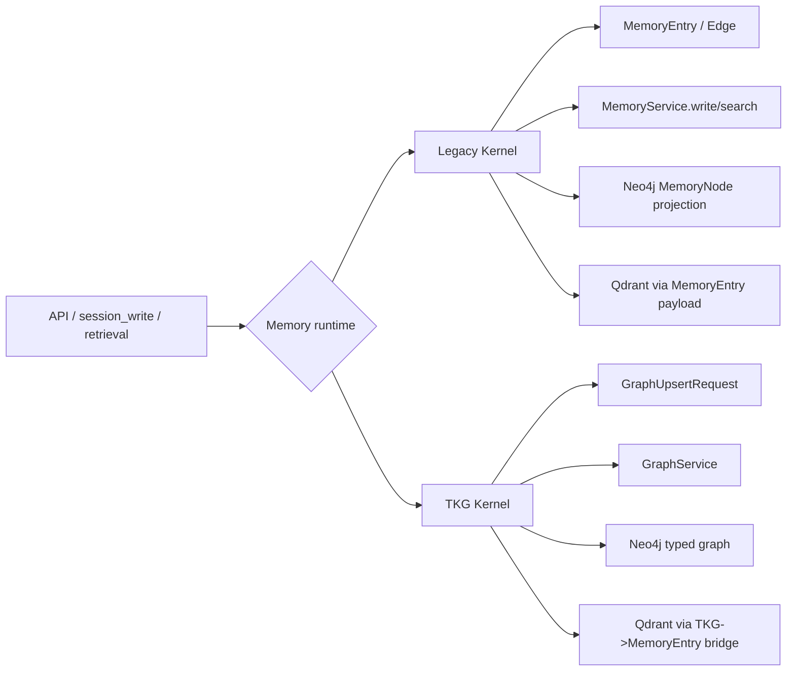
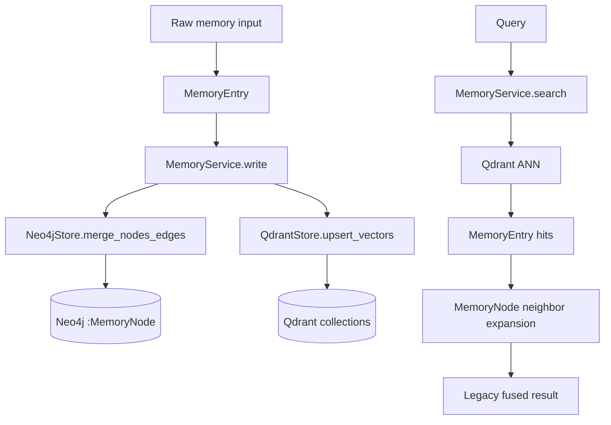
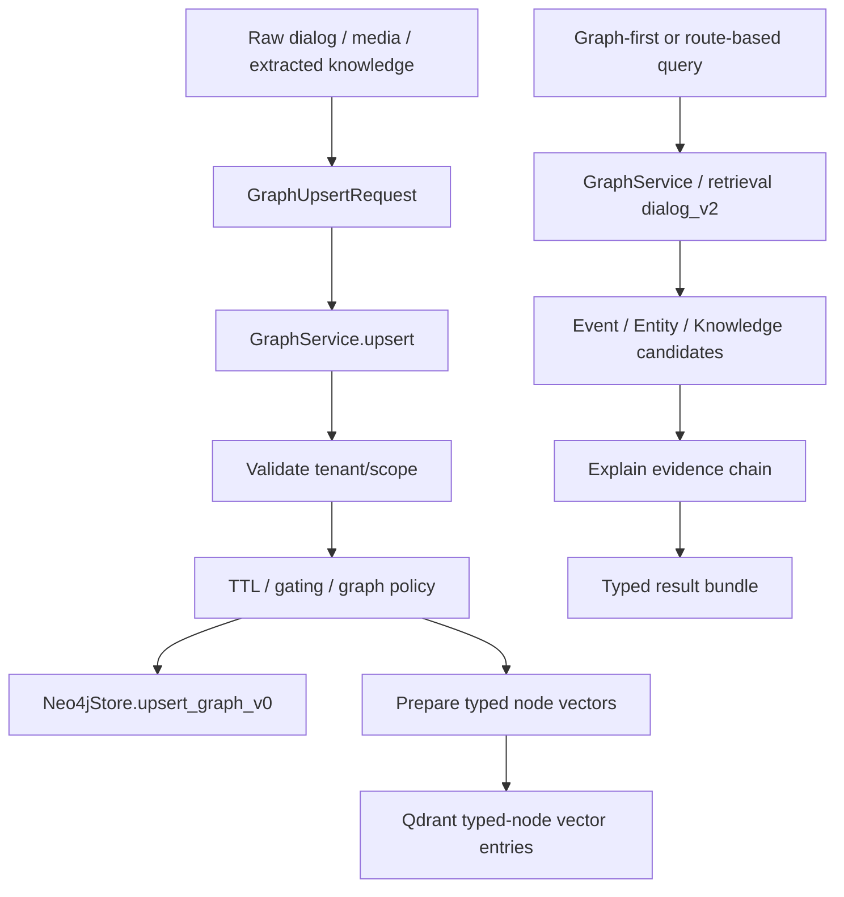
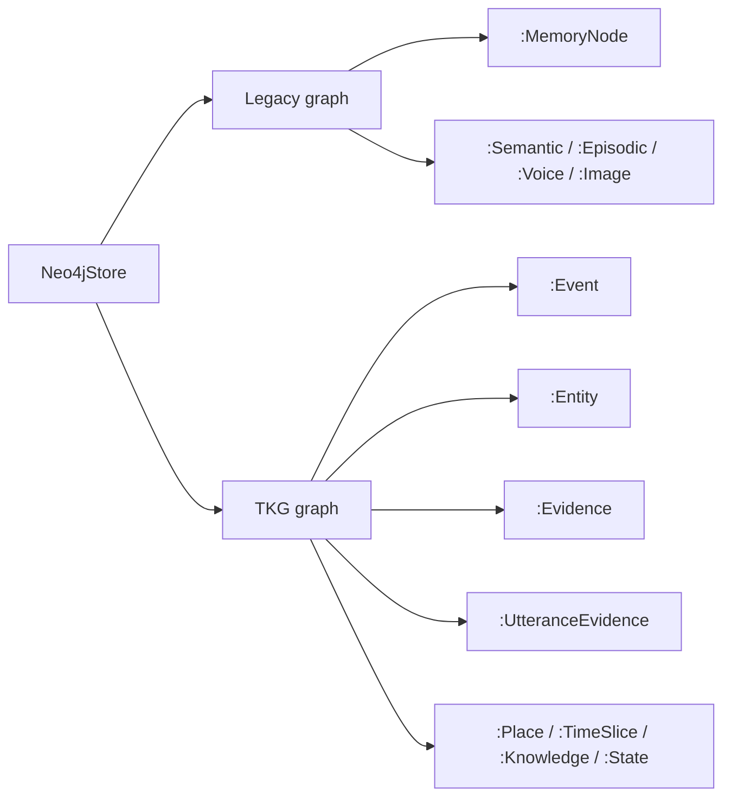
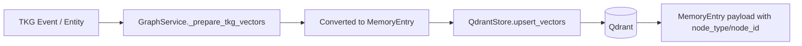
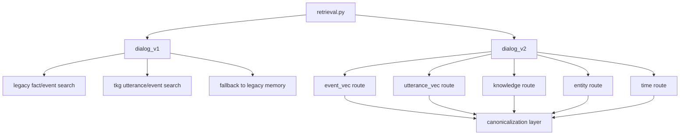
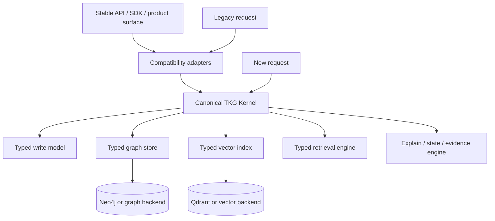

# 架构演化方向

## 1. 这份文档回答什么问题

这份文档只回答 4 个问题：

1. Memory 当前到底有哪两个内核
2. 这两个内核在底层是分开的，还是缠在一起的
3. 如果只看最新 TKG，这套架构本身做得怎么样
4. 未来应该沿着什么方向演化，才能把系统收敛成一个真正的长期底座

结论先行：

- 当前确实存在两个真实内核，不只是“历史包袱”
- 它们不是完全独立，但也没有缠死
- 图模型层已经部分分离，向量层和检索编排层仍明显交叉
- 最新 TKG 方向是对的，能力也已经成型，但还没有彻底成为唯一内核

---

## 2. 当前系统的真实形态

### 2.1 不是单内核，而是双内核共存

当前 Memory 不是一个单一架构，而是两个核心范式并存：

- Legacy kernel：统一条目记忆
- TKG kernel：类型化知识图记忆

它们共享同一个产品外壳、同一套服务进程、同一套基础设施连接，但内部模型和读写路径不同。

### 2.2 当前最准确的判断

如果用一句话描述现在的架构：

> 一个线上可用的 Memory 平台，外层已经统一，但内部仍处于“legacy 内核 + TKG 新内核 + 大量兼容桥接”的过渡态。

---

## 3. 两个内核分别是什么

## 3.1 Legacy kernel：统一条目记忆内核

Legacy kernel 的核心抽象是：

- `MemoryEntry`
- `Edge`
- `MemoryService.write/search/update/delete`
- Neo4j 中的 `MemoryNode` 投影图
- Qdrant 中以 `MemoryEntry` 作为 payload 的向量条目

它的世界观是：

- 一切记忆先统一成扁平条目
- 图关系只是条目之间的补充关系
- 向量检索是主入口
- 图扩展主要服务于邻域补全和解释

### Legacy kernel 的优点

- 模型简单
- 对外接口稳定
- 对兼容历史数据和多来源输入很友好
- 作为统一 Memory API 的起点是成功的

### Legacy kernel 的本质限制

- 语义表达能力弱
- 结构化证据链不天然
- 时间、实体、知识、状态都要靠 metadata 和启发式补足
- 很难自然承载 graph-first retrieval

---

## 3.2 TKG kernel：类型化知识图内核

TKG kernel 的核心抽象是：

- `GraphUpsertRequest`
- `Event / Entity / Evidence / UtteranceEvidence / MediaSegment / Place / TimeSlice / State / Knowledge`
- `GraphService`
- Neo4j 中的 typed graph
- 以 typed node 为中心的 explain / graph search / state reasoning

它的世界观是：

- 记忆首先是有类型的知识对象
- 图不是补充结构，而是主语义结构
- 向量索引用于 typed node 检索，不再是唯一真相
- explain chain 是一级能力，不是调试副产物

### TKG kernel 的优点

- 数据模型语义清晰
- 支持实体、事件、证据、时间、地点、状态、知识等 typed reasoning
- 能自然表达 evidence chain
- 更适合长期作为平台内核

### TKG kernel 当前的本质位置

TKG 不是概念草图，而是已经落地的真实内核。

它已经具备：

- typed write path
- typed query path
- event explain path
- state path
- graph-first search path
- dialog_v2 多路召回中的主干角色

问题不在于它不存在，而在于它还没有彻底收拢全系统。

---

## 4. 底层有没有交叉

答案是：有，而且交叉点很明确。

## 4.1 图存储层：部分分离

图层其实已经做了较好的“标签级分离”：

- Legacy 写入 Neo4j 的 `:MemoryNode`
- TKG 写入 Neo4j 的 `:Event / :Entity / :Evidence / :UtteranceEvidence / ...`

这一点意味着：

- 它们不是物理完全独立
- 但也不是写到同一套标签里互相污染
- 图模型层面具备继续剥离的基础

## 4.2 向量层：明显交叉

这里是当前最关键的耦合点。

虽然 TKG 已经有 typed graph，但它的向量写入仍然不是独立 schema，而是：

1. `GraphService` 先把 `Event/Entity` 转成 `MemoryEntry`
2. 再通过 `QdrantStore.upsert_vectors()` 写入
3. 再通过 payload 里的 `node_type / node_id / tkg_event_id` 识别回来

也就是说：

> TKG 的向量层目前是“借壳运行”在 legacy 的 MemoryEntry vector abstraction 之上。

这说明：

- 图内核已 typed
- 向量内核还没 typed
- TKG 尚未拥有完全独立的 vector kernel

## 4.3 检索编排层：混合最重

检索层当前不是“legacy 一套、TKG 一套完全平行”，而是共享同一个编排壳：

- `MemoryService.search()` 同时支持 `memory | tkg` graph backend
- `retrieval.py` 会同时处理 legacy event id 和 tkg event id
- TKG 无结果时，部分路径会 fallback 到 legacy episodic search

这里的判断是：

- 不是缠死
- 但已经在“检索语义”这一层形成深度混合

---

## 5. 两个内核到底是可剥离，还是纠缠在一起

## 5.1 结论

结论不是二选一，而是分层判断：

| 层 | 状态 | 判断 |
| --- | --- | --- |
| 数据模型 | 已明显分化 | 可剥离 |
| Neo4j 标签空间 | 已部分分离 | 可剥离 |
| Neo4j store 实现体 | 同文件双栈 | 可拆但未拆 |
| Qdrant payload schema | 仍以 `MemoryEntry` 为中心 | 暂不可自然剥离 |
| 检索编排 | 深度混合 | 当前最难剥离 |
| API 表面 | 已统一 | 不应直接拆分 |

### 最准确的表述

> 当前不是“两个系统互不相干”，也不是“完全缠死无法拆”。  
> 它处于“图模型半分离、向量和检索壳仍共用”的过渡态。

## 5.2 如果今天就想硬拆，会卡在哪

主要会卡在 5 个地方：

1. TKG vector 仍通过 `MemoryEntry` 载荷进入 Qdrant
2. `QdrantStore.search_vectors()` 的返回类型仍是 `MemoryEntry`
3. `MemoryService.search()` 仍承担 memory/tkg 双路检索壳
4. `retrieval.py` 里存在 legacy id 与 tkg id 的 canonicalization
5. 线上接口仍要保持历史兼容，不可能把 legacy 一次性拔掉

---

## 6. 如果只看最新 TKG，这套架构本身怎么样

这里先把 legacy 与兼容包袱拿掉，只看 TKG 本身。

## 6.1 TKG 做得好的地方

### 1. 模型已经形成体系，不是零散补丁

TKG 不是只增加了几个新类，而是已经形成完整 typed schema：

- Event
- Entity
- Evidence
- UtteranceEvidence
- MediaSegment
- Place
- TimeSlice
- State
- Knowledge
- PendingState / PendingEquiv

而且这些对象共享一套治理字段：

- tenant
- scope
- published
- ttl / expires_at
- importance
- memory_strength
- provenance

这说明 TKG 已具备“平台内核模型”的雏形。

### 2. GraphService 已经具备内核味道

`GraphService` 不是简单的 service 包装器，它已经承担了内核职责：

- tenant 一致性校验
- scope 一致性校验
- gating
- TTL default
- typed vector preparation
- event / entity / state / explain 读接口

这一点是对的，说明新内核不是散落在 API 层里。

### 3. 读能力已经比 legacy 明显更强

TKG 现在已经支持：

- `search_event_candidates`
- `query_events`
- `query_event_detail`
- `query_event_evidence`
- `state` current/history/pending

这说明它已经不是“只会写图”的后端，而是具备 graph-native read model。

### 4. `dialog_v2` 已经开始围绕 TKG 组织

`dialog_v2` 的主干路线基本是：

- Event vector index
- Utterance vector index
- Knowledge route
- Entity route
- Time route
- RRF + recency + graph signal

这说明 TKG 不是一个孤立存储，而是已经被拉进核心 retrieval engine。

## 6.2 TKG 目前最大的不足

### 1. 向量层不是原生内核

这点最重要。

TKG 当前的向量化策略是“typed node -> MemoryEntry bridge -> Qdrant”。
这意味着：

- typed graph 是新的
- typed vector kernel 还不是新的

所以 TKG 现在还没有完全拥有自己的检索底座。

### 2. 图扩展还不够原生

在统一搜索路径里，TKG 邻域扩展很多时候不是直接 typed traversal，而是通过 `graph_explain_event_evidence` 拼装 neighbors 结果。

这说明：

- explain 很强
- 但 graph retrieval kernel 还没有完全内化成统一邻域算子

### 3. 一致性模型偏弱

当前 TKG 写入是：

1. 先写 Neo4j
2. 再写 Qdrant
3. Qdrant 失败时仅记录日志，不回滚图

这对线上可用性友好，但对平台内核来说不够强，会留下“图真相存在、向量召回退化”的隐性状态。

### 4. TKG 的实现组织还不够收敛

虽然模型是 typed 的，但很多核心能力仍压在一个巨大的 `Neo4jStore` 里。

这意味着：

- TKG 在架构概念上已经成立
- 但在代码组织上还没有完成真正的“内核化”

---

## 7. 当前最准确的架构判断

可以用一句更工程化的话描述当前状态：

> Legacy kernel 是旧内核，TKG 是新内核；图模型层已基本分叉，向量与检索编排仍在同一运行壳中共享。

如果再压缩成一句话：

> TKG 已经足够强，可以成为唯一未来内核；但它还没有彻底摆脱 legacy 的 vector schema 与 retrieval shell。

---

## 8. 架构演化方向

不建议继续把系统长期维持在“双内核 + 大量桥接”的稳定态。  
更合理的方向是：

> 对外稳定，内部收敛到 TKG 单内核。

## 8.1 演化原则

### 原则 1：外部接口稳定，内部真相唯一

- 对外继续保留现有 HTTP / SDK / 产品接口
- 内部逐步收敛到唯一 canonical model：TKG

### 原则 2：兼容逻辑留在边界，不再深入内核

- legacy 输入可以保留
- 但它应该只存在于 adapter / translator 层
- 新功能不再直接写 legacy kernel

### 原则 3：先收敛向量层，再收敛检索编排

当前最深的耦合不是图，而是：

- `MemoryEntry` 作为 vector payload
- `search_vectors()` 返回 `MemoryEntry`
- `retrieval.py` 里同时理解两套 event identity

所以演化顺序应该是：

1. typed vector payload
2. typed retrieval abstraction
3. legacy adapter 外移

## 8.2 推荐目标形态

这个目标形态有两个核心变化：

1. TKG 变成真正唯一内核
2. legacy 不再是第二套核心，只是兼容入口

---

## 9. 最少需要切开的 5 个耦合点

如果未来要让 TKG 成为真正独立底座，最少要切开下面 5 个点：

### 1. TKG vector payload 不再借用 `MemoryEntry`

目标：

- typed node 写 typed vector document
- payload schema 原生携带 node semantics
- 不再依赖 legacy `kind/modality/contents` 解释回来

### 2. `QdrantStore.search_vectors()` 不再只返回 `MemoryEntry`

目标：

- 引入 typed vector hit
- 返回 EventHit / EntityHit / EvidenceHit 等 typed candidate

### 3. `MemoryService.search()` 从“双后端壳”退回“兼容门面”

目标：

- 统一搜索内核迁到 typed retrieval engine
- `MemoryService.search()` 仅作为 legacy facade

### 4. `retrieval.py` 里的 id canonicalization 外移

目标：

- logical_event_id / tkg_event_id 的兼容映射放到 adapter 层
- retrieval engine 内部只认 canonical TKG identity

### 5. `Neo4jStore` 中 legacy 与 TKG 的实现体拆分

目标：

- typed graph store
- legacy projection store

哪怕共享 driver，也不应继续共享实现巨石。

---

## 10. 最终结论

### 10.1 关于“双内核”

当前确实有两个真实内核：

- Legacy kernel：`MemoryEntry` 世界
- TKG kernel：typed graph 世界

### 10.2 关于“是否缠死”

没有缠死，但已经在以下层面深度耦合：

- vector schema
- retrieval orchestration
- service facade

因此它是“可剥离但需要分阶段”的状态。

### 10.3 关于“如果只看 TKG”

如果只看最新 TKG：

- 架构方向是对的
- 模型是成熟的
- 核心读写能力已经成型
- explain / state / event-centric retrieval 都有价值

但它目前还不是完全干净的独立底座，因为：

- vector kernel 仍借壳 legacy
- retrieval shell 仍混用 legacy/TKG
- 实现组织仍偏巨石

### 10.4 关于“演化方向”

最合理的方向不是继续长期双核共存，而是：

> 保持产品外壳稳定，把内部逐步收敛成以 TKG 为唯一 canonical kernel 的 memory 底座。

---

## 11. 一句话版本

如果只留一句话给架构评审会：

> Memory 当前是“legacy 统一条目内核 + TKG 类型化知识图内核”的双核过渡态；TKG 已足够强，应该成为唯一未来内核，但在那之前必须先切开向量 schema 与检索编排层的 legacy 耦合。
